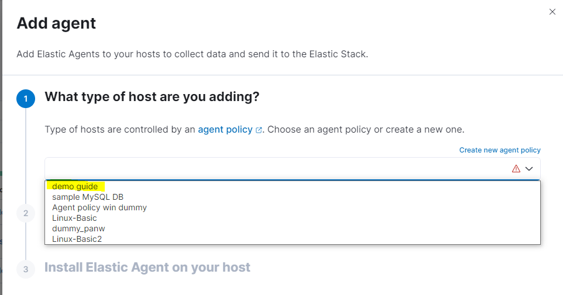
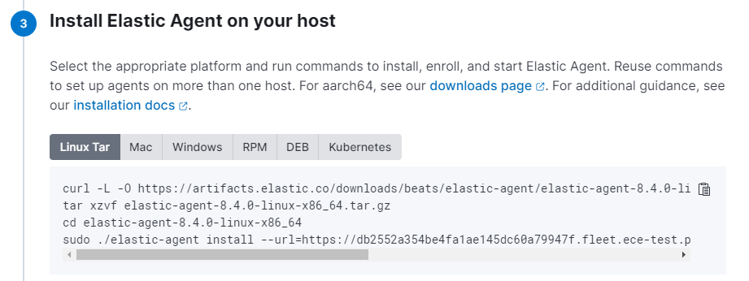

# Laden von Daten in Elastic

Nachdem Ihr Deployment eingerichtet wurde, können Sie mit Elastic Agent und Fleet Daten aus Ihren Logdaten-Quellen (Log Sources) an Ihr Deployment senden. Dieses Dokument beschreibt die nötigen Schritte.

## Begriffsklärung

Bevor wir beginnen, möchten wir einige Begriffe erklären, die in diesem Dokument verwendet werden.

|Begriff                 |Definition            |
|:-------------------------|:--------------------|
| Elastic Agent  | Komponente für die Sammlung von Log- und Metrikdaten, die Client-seitig auf den Logdaten-Quellen installiert wird. Es handelt sich um die einzige Komponente, die installiert werden muss, da sie alle Beats mitbringt und diese mit den zugehörigen Konfigurationen auf dem Client (Klienten) verwaltet. |
| Fleet Server  | Komponente im Elastic-Deployment, mit der die Agenten verwaltet werden. Alle Einstellungen in Fleet werden in Kibana vorgenommen.|
| Integration  | In diesem Zusammenhang handelt es sich um eine (meist durch Elastic selbst) vorkonfigurierte Zusammenstellung von Agenteneinstellungen, Ingest-Pipelines und Kibana-Dashboards für einen bestimmten Logdaten-Quellen-Typ (z. B. Tomcat, Nginx, MySQL, Cisco Komponenten, ...). Für die gängigsten Logdaten-Quellen sind Integrationen verfügbar (siehe: [https://www.elastic.co/de/integrations/data-integrations](https://www.elastic.co/de/integrations/data-integrations)).   |
| Agent Policy    | Eine Sammlung von Einstellungen und Integrationen in Form einer Richtlinie (Policy), die dem Agenten und den darunter liegenden Beats mitteilt, welche Daten wo gesammelt werden sollen. Sie benötigen für jeden **Quellentyp** eine **separate** Agentenrichtlinie (Agent Policy). Wenn beispielsweise alle Ihre MySQL-Datenbanken ihre Logdateien im selben lokalen Pfad speichern (was sie ohnehin tun sollten), reicht eine Agentenrichtlinie für MySQL-Datenbanken aus. Eine Agentenrichtlinie kann **mehrere** Integrationen enthalten. Somit kann ein Agent Logdateien von mehreren Anwendungen auf derselben Quelle sammeln. Sie können nur **eine** Richtlinie pro Agent haben. Angenommen, Sie haben auf einigen Hosts nur Apache httpd und auf anderen Hosts httpd und Tomcat installiert, dann benötigen Sie mindestens zwei Agentenrichtlinien: eine für httpd und eine für httpd+tomcat.  |
| Enrollment Token   | Wird vom Agenten beim Start auf dem Client benötigt. Das Token erfüllt zwei Zwecke: Erstens, ermöglicht es die Erstauthentifizierung des Agenten gegenüber den Fleet- und Elastic-Servern. Zweitens, verweist es auf genau eine Agentenrichtlinie, sodass der Fleet-Server dem Agenten mitteilen kann, von welchen Quellen er Daten sammeln soll. Jede Agentenrichtlinie verfügt über mindestens ein Registrierungstoken. Registrierungstokens sind von Natur aus sensible Daten und sollten daher auf sichere Weise gespeichert werden.|

## Erstellen der Agentenrichtlinie

Da die Agentenrichtlinie für den Agenten definiert, welche Daten erfasst werden sollen, muss diese als erstes definiert werden. Definieren Sie am besten eine Agentenrichtlinie **pro** Quellentyp.

Gehen Sie in Kibana zu **Fleet → Agent Policies**. Erstellen Sie eine neue Agentenrichtlinie und geben Sie ihr einen aussagekräftigen Namen (meist ist es nicht nötig, die *Advanced* Optionen zu ändern). Klicken Sie dann auf Ihre neue Integration. Sie werden sehen, dass bereits eine Integration, die Systemintegration, vorkonfiguriert ist. Diese sammelt die System-Logs und Metriken vom Client-Computer. Sie müssen sich keine Sorgen wegen des Betriebssystems machen. Egal ob Linux, Windows oder MacOS, der Agent findet das selbst heraus und konfiguriert sich korrekt.

Fügen Sie je nach Art der Quelle, von der Sie Daten sammeln möchten, weitere Integrationen hinzu, wie z.B. Apache Produkte:

Durch einen Klick auf die entsprechende Kachel erhalten Sie nicht nur einen Überblick darüber, was die Integration beinhaltet. Sie können, nachdem Sie "Add Integration" ausgewählt haben, auf der nachfolgenden Bildschirmseite auch die Einstellungen anpassen. Der Inhalt der Seite ist vom Typ der Integration abhängig. Wenn Sie Ihre MySQL-Logdaten beispielsweise nicht im Standardpfad speichern, können Sie dies hier ändern. Es wird wahrscheinlich ungefähr wie in dem folgenden Bild aussehen:

## Abrufen des Enrollment Tokens

Für jede Agentenrichtlinie wird automatisch ein Enrollment Token (Registrierungstoken) mit dem Namen **Default** erstellt. Dieses können Sie jederzeit in Kibana abrufen.

## Installieren des Agenten auf dem Content-Host

In Kibana gibt es einen Wizard, der Sie bei der Installation des Agenten auf den Clients unterstützt. Für den ersten Rollout dieser Art starten Sie die Installation in **Kibana → Fleet → Agents → Add Agent**. Bei mehreren Agenten mit der selben Agentenrichtlinie können Sie die Installation auch automatisieren, da die Installationsbefehle und -parameter identisch sind.

Wählen Sie die richtige Agentenrichtlinie für den Host aus, auf dem Sie die Installation durchführen möchten. Lassen Sie **Enroll in Fleet** aktiviert. Kibana präsentiert Ihnen dann verschiedene Optionen für die Befehle, die auf dem Client-Computer auszuführen sind:

Der URL-Parameter ist automatisch auf das Deployment eingestellt, in dem Sie sich gerade befinden, und das Enrollment-Token verweist auf die Agentenrichtlinie. Sobald diese Befehle auf dem Client-Computer ausgeführt werden, registriert sich der Agent beim Fleet-Server und erscheint in Kibana in der Agentenliste.

Alle nachfolgenden Installationen von Agenten, die dieselbe Agentenrichtlinie verwenden, verfügen über denselben Befehls- und Parametersatz. Sie müssen den Assistenten nicht erneut durchlaufen. Sie können somit diesen Installationsteil im Tool Ihrer Wahl automatisieren.

## Auszuführende Schritte nach der Installation

Überprüfen Sie unbedingt die Lifecycle Policies (ILM), einschließlich aller vom System bereitgestellten Richtlinien wie **logs** und **metrics**. Standardmäßig sind diese mit einer **unbegrenzten** Lebensdauer versehen. Wir empfehlen, das zu ändern.

Entdecken Sie die ansprechenden neuen Dashboards, die mit jeder zusätzlichen Integration geliefert werden.

Machen Sie sich mit dem *Fleet-Menü* in Kibana vertraut. Suchen Sie nach möglichen Aktualisierungen für die Agentenversionen oder Integrationen. Sie können all dies im Fleet-Menü in Kibana erledigen, dafür müssen Sie sich nicht auf den Client-Computern einloggen.
