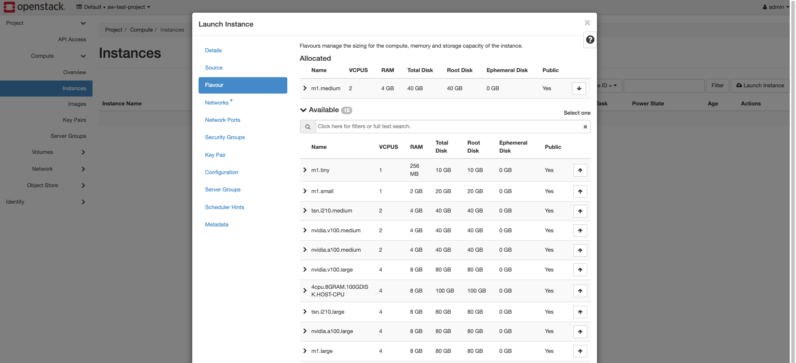
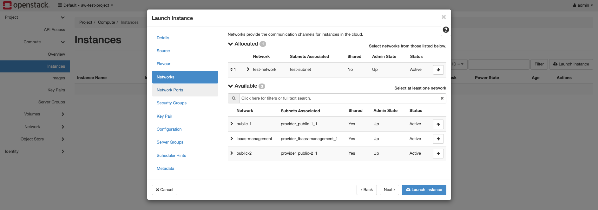

# Creation of a VM

To create a new Virtual Machine in OpenStack, you need to log in to the OpenStack Dashboard. This access is only available to administrators.

After logging in, new VMs can be created in the "Instances" tab.

Click on "Launch Instance" to be guided through the creation of the VM using a wizard.

## Details

Here, the name for the VM can be chosen. Additionally, the number of VMs can be changed; the default is one.

## Source

Here, you can choose whether the instance should be created from an existing volume.

Or whether the VM should be created from an image.

Furthermore, you can set whether a new volume should be created for the VM and whether this volume should be deleted along with the VM.

## Flavor

Here, you can specify the size of the VM and whether it should be equipped with a graphics card or TSN card if necessary.

## Network

Here, you can select the network to which the VM will be connected during creation.

## Key Pair

Here, the SSH key can be selected for connecting via SSH. Additionally, new SSH keys can be imported here.

