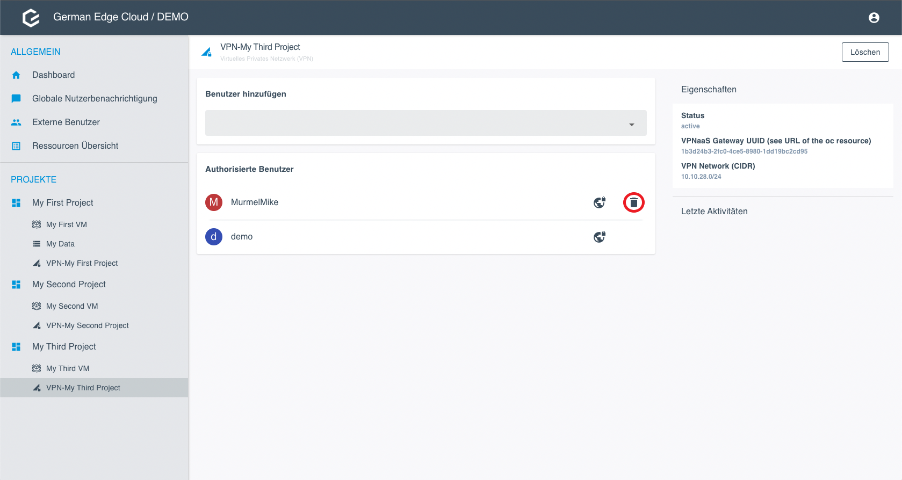

# VPN as a Service

## Übersicht

Dieser Abschnitt veranschaulicht, wie die Nutzer mit dem Kundenprojekte von OpenStack über das OpenStack-Projekt-VPN-Gateway kommunizieren. Das OpenStack-Projekt-VPN-Gateway verwendet eine einzige öffentliche IP-Adresse. Es authentifiziert und leitet den Datenverkehr über verschiedene Ports zu den jeweiligen VPN-Servern weiter. Typischerweise hat jedes Projekt seinen eigenen VPN-Server. In dieser Konfiguration hat jedes VPN-Gateway eine einzige öffentliche IP-Adresse, die für alle VPN-Server gültig ist.

## Zweck

GEC bietet eine VPNaaS-Lösung an, die es dem Kunden ermöglicht, ihre Anwendungen und Systeme mit den Systemen von Projektpartner zu integrieren. Externer Partner können Einzelpersonen sein, die mit ihren Computern oder Kommunikationssystemen auf das Projekt zugreifen.

## Anforderungen

Die VPNaaS-Lösung hat folgende Anforderungen:

- Das Gateway benötigt eine öffentlich erreichbare IP welche mit der Floating-IP verbunden ist.

## Einschränkungen

Die VPNaaS-Lösung unterliegt den folgenden Einschränkungen:

- Die Anzahl der VPN-Server wird durch den vordefinierten Portbereich im Gateway begrenzt.
- Das Netzwerk unterstützt bis zu 250 Benutzer.
- Konfigurationsänderungen am Gateway und Server sind nach der Erstellung nicht möglich; sie müssen neu erstellt werden.
- Nach der Neuerstellung werden alle OVPN-Konfigurationen ungültig.

## Komponenten und Kommunikationsfluss

Dieser Abschnitt umreißt den Kommunikationsfluss zwischen dem Operations Center und den Kunden-VPN-Servern. Der Kunde initiiert eine Anfrage, und das VPN-Gateway authentifiziert und leitet die Anfragen an den jeweiligen VPN-Server weiter.

### VPN Gateway

Das VPN-Gateway dient als zentrale Managementzentrale für GEC.
Es verwaltet VPN-Server und die Externe Verbindungen.
Mit nur einer öffentlichen IP-Adresse stellen IPtable-Regeln sicher, dass Verbindungen zum richtigen VPN-Server geleitet werden.
Diese Einrichtung erfordert ein Wide Area Network (WAN) und ein mit dem VPN-Gateway verbundenes VPN-Transfernetzwerk.
Das VPN-Gateway verwaltet ausschließlich VPN-Server und Proxy-Verbindungen zu und von diesen Servern, um sicherzustellen, dass der Datenverkehr sein beabsichtigtes Ziel erreicht.

### VPN Server

Der VPN-Server verwendet OpenVPN, um VPN-Verbindungen mit dem Kundennetzwerk herzustellen.
Diese Netzwerkverbindung arbeitet in einem eigenen Virtual Routing and Forwarding (VRF), um die Isolation zu verbessern, ohne zusätzliche Ports freizugeben.
Externe Verbindungen werden über das VPN-Gateway geroutet.
Der API-Server für den VPN-Server verwaltet den auf der Maschine laufenden OpenVPN-Server.

## Sicherheit

### WAN

- Nur die für die bestehende VPN-Server erforderlichen Ports sind geöffnet.
- SSH ist deaktiviert.
- Virtual Routing and Forwarding (VRF)-Trennung ist verfügbar.
- Sicherheitsgruppen erlauben nur die VPN-Server-Portbereiche.
- Firewall-Regeln sind vorhanden und werden bei Bedarf angepasst.

### VPNaaS

- Separate VRF wird für WAN verwendet.
- Firewall-Regeln sind vorhanden und werden bei Bedarf angepasst.
- SSH- und API-Zugriff werden bereitgestellt.
- SSH-Schlüsselauthentifizierung wird verwendet.

## Server- und Benutzerverwaltung

### Serverstatus

1. Klicken Sie auf die VPN-Ressource.
2. Überprüfen Sie den Status unter Eigenschaften. Die Konfigurationsbearbeitung ist nur möglich, wenn der Status aktiv ist.

### Benutzer hinzufügen

*Hinweis*: Der Projektinhaber wird automatisch für den Remotezugriff hinzugefügt und kann nicht entfernt werden.

*Voraussetzungen*: Sie können nur Benutzer auswählen, die zuvor dem Projekt hinzugefügt wurden.

1. Gehen Sie zur VPN-Konfiguration.
2. Wählen Sie den gewünschten Benutzer aus, um ihn als VPN-Benutzer hinzuzufügen.

3. Speichern Sie die Auswahl. Der Benutzer wird sofort hinzugefügt.

### OVPN-Konfiguration und Passphrase erhalten

*Hinweis*: Sie können die OVPN-Konfiguration nur für sich selbst oder als Projektinhaber für externe Benutzer herunterladen und eine Passphrase anzeigen. Sie können die OVPN-Konfiguration oder Passphrasen für andere Benutzer nicht herunterladen.

1. Gehen Sie zur VPN-Konfiguration.
2. Klicken Sie auf den Welt-Icon-Link und wählen Sie zwischen Download und Passphrase.

### Benutzer löschen

1. Klicken Sie auf das Löschsymbol neben dem Benutzer, den Sie löschen möchten.

1. Klicken Sie auf Speichern.

