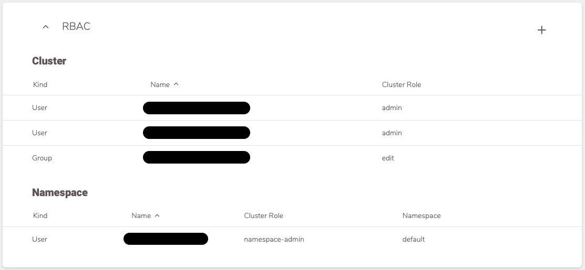

Prinzipiell gibt es zwei Möglichkeiten, Benutzern Zugriff auf ein iMKE-Cluster zu gewähren:

* Dem Benutzer Zugriff auf ein iMKE-Projekt (und damit aller enthaltenen Cluster) geben.
* Dem Benutzer via "Role-Based Access Control" (RBAC) direkten Zugriff auf das Cluster bzw. einzelne Namespaces geben.

## Zugriff via IMKE-Projekt

> Dies ist die empfohlene Methode, anderen Benutzern Zugriff zu gewähren.

Erteilt man Benutzern Zugriff auf ein gesamtes iMKE-Projekt (wie [hier](/imke/managingprojects/creatingaproject/) beschrieben), bekommen Benutzer automatisch Zugriff auf alle Cluster innerhalb dieses Projektes. Die Benutzer können sich in iMKE einloggen, und nach Auswahl des Projektes alle Cluster sehen bzw. je nach gewährten Zugriffsrechten auch bestehende Cluster editieren oder neue Cluster anlegen. Weiterhin können die Benutzer auch ihre `kubeconfig` direkt herunterladen:

Dabei teilen sich alle Benutzer mit den gleichen Zugriffsrechten effektiv eine kubeconfig, da in diesem Fall einen token-basierte Authentifizierung genutzt wird und je Access-Level ein Token erstellt wird. Wenn der Zugriff für einen Benutzer mit projektweitem Zugriff entzogen werden soll, muss daher die `Revoke Token`-Funktion des Clusters genutzt werden. Bestehende Token werden dann ungültig - und in der Folge müssen sich alle verbliendenen Benutzer eine neue kubeconfig herunterladen.

## Role-based Access Control (RBAC)

Die RBAC-Funktion wiederum erlaubt es einem iMKE-Projekt-Admin, einen feingranulareren Zugriff basierend auf vordefinierten `ClusterRoles` und `Roles` zu gewähren. Über das iMKE Dashboard kann ein Admin dafür einfach (cluster-weit gültige) `ClusterRoleBindings` und (nur in einem bestimmten Namespace gültige) `RoleBindings` anlegen:

Ein Benutzer mit diesem Zugriffslevel wiederum hat keinen Zugriff auf das iMKE-Dashboard, kann sich jedoch über einen bestimmten Link (s.u.) seine eigene kubeconfig-Datei herunterladen und damit Zugriff auf das Cluster bekommen.

Mehr über Kubernetes RBAC finden Sie [hier](https://kubernetes.io/docs/reference/access-authn-authz/rbac/).

