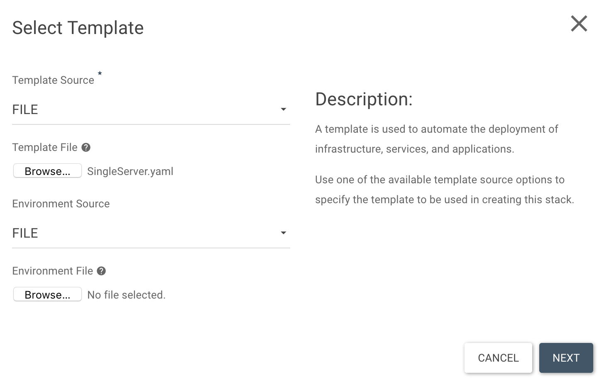

Schritt 3: Einen Stack starten
==============================

Vorwort
-------

In diesem Schritt beschäftigen wir uns damit, im Horizon Dashboard
einen Stack zu starten und damit auch das Horizon Dashboard besser
kennenzulernen. 

Wichtige Voraussetzung ist an dieser Stelle ein SSH-Key, den wir in
[Schritt 2](schritt02.md) erzeugt haben.

Start
-----

Um einen Stack zu starten, loggen wir uns zunächst im Horizon Dashboard
mit denen in [Schritt 1](schritt01.md) geänderten Zugangsdaten ein. 

Hier navigieren wir über *Orchestration* zu *Stacks* und klicken auf *Launch
Stack*.

Um den Stack auch zu starten, benötigen wir zunächst ein Template,
welches in dem Stack eine Instanz startet.

Hierfür nutzen wir die [SingleServer.yaml](https://github.com/innovocloud/openstack_examples/blob/master/heat/templates/SingleServer/SingleServer.yaml) aus dem [iNNOVO Github Repository](https://github.com/innovocloud).

In dem sich nun öffnenden Fenster, wählen wir bei *Template Source* 
**File** aus und nehmen bei *Template File*, die eben heruntergeladene
`SingleServer.yaml`. 

Den Rest belassen wir so wie es ist und klicken auf *Next*.

Nun werden weitere Eingaben benötigt, genauer sind das folgende und am
Ende klicken wir auf Launch:

-   Stack Name: BeispielServer
-   Creation Timeout: 60
-   Password for User: Bitte das eigene Passwort eintragen
-   availability\_zone: ix1
-   flavor\_name: m1.micro
-   key\_name: BeispielKey
-   machine\_name: singleserver
-   public\_network\_id: provider

Nun wird der Stack auch direkt gestartet und das Horizon Dashboard
sieht dann so aus:

Um nun zu überprüfen ob die Instanz korrekt gestartet wurde, wechseln
wir in der Navigation auf *Compute* → *Instances* und die Übersicht sieht
dann wie folgt aus:

Nachdem nun also der Stack und auch die darin enthaltene Instanz
gestartet wurden, löschen wir jetzt wieder den Stack inklusive Instanz.

Wir könnten auch die Instanz alleine löschen, das kann aber im Nachgang
zu Problemen beim löschen des Stacks führen. 

Um den Stack zu löschen, wechseln wir in der Navigation wieder auf
*Orchestration* → *Stacks*.

Klicken hinter dem Stack, unter *Actions*, auf den Pfeil nach unten und
wählen dort *Delete Stack*.

Abschluss
---------

Nachdem nun der Stack erstellt und direkt wieder gelöscht ist, beschäftigen wir
uns im [nächsten Schritt](schritt04.md) mit dem Wechsel auf die Konsole.
