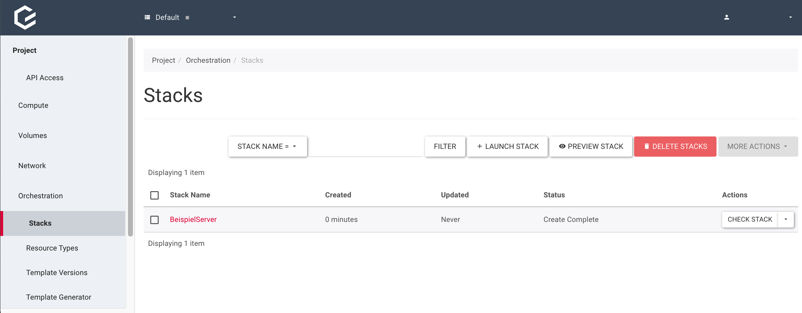

Step 3: Spawn a new Stack
=========================

Introduction
------------

In this step we will use the dashboard to spawn a stack that includes a
VM.

We will also use this step to get better acquainted with the dashboard.

For this step we will need the SSH keypair created in Step 2.

Start
-----

To spawn a new stack, we will need a template that starts a VM.

In this tutorial we use
the [SingleServer.yaml](https://github.com/gecio/openstack_examples/blob/master/heat/templates/SingleServer/SingleServer.yaml) from
our [GECio Github Repository](https://github.com/gecio) and recommend you do the same.

Once we acquired the template, we need to login to the dashboad with the
password that we changed in step 1.

Now we can go to *Orchestration → Stacks* and click on *Launch Stack*:

In the dialog that pops up, we select *File* as our *Template Source*
and use the downloaded *SingleServer.yaml* as our *Template File*, and
click *Next*.

In the next page of the dialog, we supply the following data:

-   Stack Name: BeispielServer
-   Creation Timeout: 60
-   Password for User: Please use your own password
-   availability\_zone: ix1
-   flavor\_name: m1.micro
-   key\_name: BeispielKey
-   machine\_name: singleserver
-   public\_network\_id: provider

After everything is filled in, we click *Launch* to spawn the stack.

The stack will spawn and it will look like this.

We can verify, if the stack has started the instance correctly.

Navigate to *Compute* -\> *Instances* and the overview should look like
this:

So we have spawned the stack, now we want to delete it including the
VM.

It's also possible to delete only the instance, but this could be
problematic if you want to delete the stack afterwards.

To delete a stack, you will navigate  to *Orchestration* *-\>* *Stack*
and click on the `down-arrow` behind the Example Stack, now we can
choose *`Delete Stack`*.

Conclusion
----------

We have created our first stack... and then deleted it!
