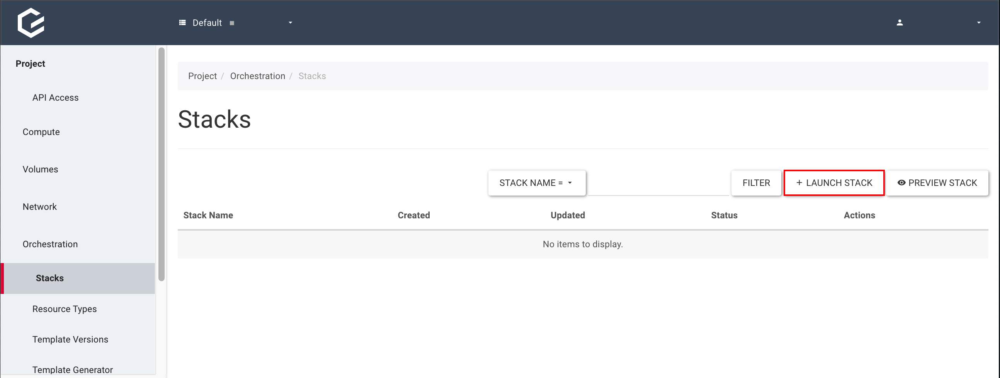
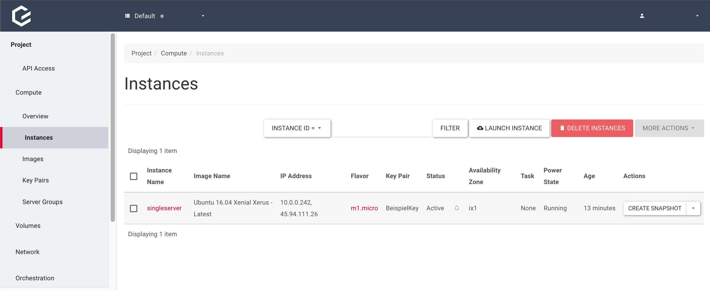
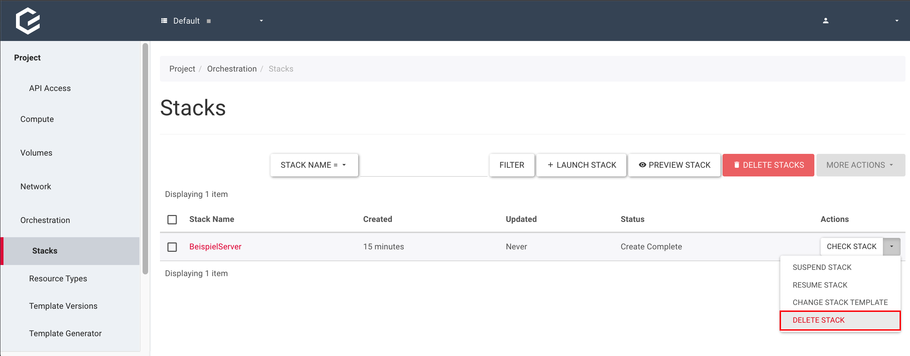

# Step 3: Spawn a new Stack

## Introduction

In this step we use the dashboard to spawn a stack that includes a
VM.

You will also get better acquainted with the dashboard.

For this step you need the SSH keypair created in Step 2.

## Start

To spawn a new stack, you need a template that starts a VM.

We recommend using
the [SingleServer.yaml](https://github.com/gecio/openstack_examples/blob/master/heat/templates/SingleServer/SingleServer.yaml) from
the [GECio Github Repository](https://github.com/gecio).

Once you acquired the template, log in to the dashboad with your new
password (see step 1).

Go to *Orchestration → Stacks* and click *Launch Stack*:

In the dialog that pops up, for *Template Source* select *File*,
and for *Template File*, use the downloaded *SingleServer.yaml*. Then click *Next*.

In the next dialog window, provide the following data:

- Stack Name: BeispielServer
- Creation Timeout: 60
- Password for User: Please use your own password
- availability\_zone: ix1
- flavor\_name: m1.micro
- key\_name: BeispielKey
- machine\_name: singleserver
- public\_network\_id: provider

After you have filled in all data, click *Launch* to spawn the stack.

The stack spawn and it looks like this.

You can verify, if the stack has correctly started the instance.

Navigate to *Compute* -\> *Instances*. The overview should look like
this:

You have spawned the stack. Now we will show you how to want to delete it including the
VM.

It is also possible to delete only the instance, but this might cause problems if you want to delete the stack afterwards.

To delete a stack, navigate to *Orchestration* *-\>* *Stack*,
and click on the `down-arrow` behind the Example Stack. Then choose *`Delete Stack`*.

## Conclusion

You created your first stack, and then deleted it.
