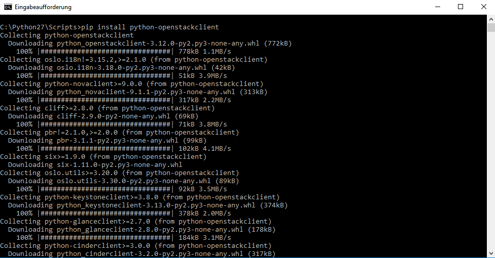

Step 4: Our way to the console
==============================

Preface
-------

To make the administration of OpenStack as simple as possible, we recommend
using
the [OpenStackClient](https://docs.openstack.org/python-openstackclient/latest/).

For simple, non-recurring tasks, it can be simpler to use the [Horizon
dashboard](https://dashboard.optimist.innovo.cloud).

As soon as tasks begin to recur, or when we want to manage a complex stack, we
prefer to use the OpenStack client and Heat.

At the start this may seem a bit complicated but once we get used to it,
managing stacks becomes fast and efficient.

The client will be helpful in our daily OpenStack work, it contains
Nova, Glance, Cinder and Neutron. We will use the client heavily in our
Guided Tour. We will walk you through installing it now.

Installation
------------

To install the OpenStackClient, we need at least [Python
2.7](https://www.python.org/downloads/release/python-2713/) and also [Python
Setuptools](https://pypi.python.org/pypi/setuptools) (which are included in
macOS).

There are a few ways to install the OpenStackClient, in our example, we
use [pip](https://de.wikipedia.org/wiki/Pip_(Python))
and we recommend you do the same.

"[pip](https://de.wikipedia.org/wiki/Pip_(Python))" is
easy to use and can also be used as update manager
for [pip](https://de.wikipedia.org/wiki/Pip_(Python)).

It's possible to install the client as root (the administrative user),
but that can potentially cause some problems, so we will install it in a
virtual environment.

### macOS

To install the OpenStackClient, we need to install
[pip](https://de.wikipedia.org/wiki/Pip_(Python)). Start the console (Launchpad
→ Console) and type this command:

```
$ easy_install pip
Searching for pip
Best match: pip 9.0.1
Adding pip 9.0.1 to easy-install.pth file
Installing pip script to /usr/local/bin
Installing pip2.7 script to /usr/local/bin
Installing pip2 script to /usr/local/bin

Using /usr/local/lib/python2.7/site-packages
Processing dependencies for pip
Finished processing dependencies for pip
```

Now we install virtualenv.

``` 
$ pip install virtualenv
Collecting virtualenv
  Downloading virtualenv-15.1.0-py2.py3-none-any.whl (1.8MB)
    100% |????????????????????????????????| 1.8MB 619kB/s
Installing collected packages: virtualenv
Successfully installed virtualenv-15.1.0
```

Now that we have virtualenv installed, we can create the virtual environment.

```
$ virtualenv ~/.virtualenvs/openstack
New python executable in /Users/iNNOVO/.virtualenvs/openstack/bin/python
Installing setuptools, pip, wheel...done.
```

Now that it's created we can activate the virtual environment.

```
$ source ~/.virtualenvs/openstack/bin/activate
(openstack) $
```

Now that the virtual environment is activated, we can install the openstack
client.

```
(openstack) $ pip install python-openstackclient
```

As we'll be using other services in our documentation, we'll install these clients as well.

```
(openstack) $ pip install python-heatclient python-designateclient python-octaviaclient
```

Now that we're done, we can deactivate our environment.

```
(openstack) $ deactivate
```

To finish it off, we'll make sure we can use the client outside of our virtual
environment.

```
export PATH="$HOME/.virtualenvs/openstack/bin/:$PATH"
```

Now we can check, if everything works and it should look like this:

```
$ type -a openstack
openstack is /home/iNNOVO/.virtualenvs/openstack/bin/openstack
```

### Windows


If Python is already installed, we need to navigate to where it's installed
(standard installation folder C:\Python27\Scripts).

To install "pip" we will use the command `easy_install pip`:


Once pip is installed, we can install the OpenStack client:



### Linux (in our example Ubuntu)

To start things off, we'll install pip.

```
$ sudo apt-get install python-pip
Reading package lists... Done
Building dependency tree
Reading state information... Done
```

Next, we'll install virtualenv, which we'll need to set up our virtual
environment.

```
$ sudo apt install python-virtualenv
Reading package lists... Done
Building dependency tree
Reading state information... Done
```

Now we can create a virtual environment, in which we can install the OpenStack
client.

```
$ virtualenv ~/.virtualenvs/openstack
New python executable in /Users/iNNOVO/.virtualenvs/openstack/bin/python
Installing setuptools, pip, wheel...done.
```

Now we activate our freshly created environment.

```
$ source ~/.virtualenvs/openstack/bin/activate
(openstack) $
```

Once activated, we can install the
[OpenStackClient](https://docs.openstack.org/python-openstackclient/latest/):

```
(openstack) $ pip install python-openstackclient
```

As we'll use heat in our documentation, we'll also install the heat
client.

```
(openstack) $ pip install python-heatclient
```

Once done, we can deactivate our virtual environment.

```
(openstack) $ deactivate
```

To finish up, we'll make sure that we can use our newly installed software.

```
export PATH="$HOME/.virtualenvs/openstack/bin/:$PATH"
```

Now we can check, if everything works and it should look like this:

```
$ type -a openstack
openstack is /home/iNNOVO/.virtualenvs/openstack/bin/openstack
```

Credentials
-----------

For the OpenStack client to work, we'll need to supply it with credentials.

We can download the credentials directly from
the [Horizon](https://dashboard.optimist.innovo.cloud/identity/)
dashboard, after we login, click on your mail Adress in the right corner
and an then on "Download OpenStack RC File v3".

### macOS | Linux

We need to source the credentials, which can be easily done
with this command (IMPORTANT: The command can only be used in the folder where
the RC file was downloaded):  

```
source EXAMPLE.sh
```

### Windows


To source the credentials in windows, it's necessary to use
*PowerShell*, *Git for Windows* or [*Linux on Windows*](https://docs.microsoft.com/en-us/windows/wsl/install-win10). 

If you're using *Git for Windows* or *Linux on Windows*, you can use the same command as described above 
in the macOS | Linux part. 

```
source EXAMPLE.sh
```

If *PowerShell* is used, we need to set every variable individually.
Every needed variable is in the previously downloaded *Beispiel.sh* 
To set the variables, use the following command:

```bash
set-item env:OS_AUTH_URL -value "https://identity.optimist.innovo.cloud/v3"
set-item env:OS_PROJECT_ID -value "Projekt ID eintragen"
set-item env:OS_PROJECT_NAME -value "Namen eintrage"
set-item env:OS_USER_DOMAIN_NAME -value "Default"
set-item env:OS_USERNAME -value "Usernamen eintragen"
set-item env:OS_PASSWORD -value "Passwort eingeben"
set-item env:OS_USER_DOMAIN_NAME -value "Default"
set-item env:OS_REGION_NAME -value "fra"
set-item env:OS_INTERFACE -value "public"
set-item env:OS_IDENTITY_API_VERSION -value "3"
```

Conclusion
----------

We now have an OpenStack client with working credentials, and the first
commands can be tested.

An overview of all OpenStack commands can be called up with the following command:

`` bash
$ openstack --help
``
