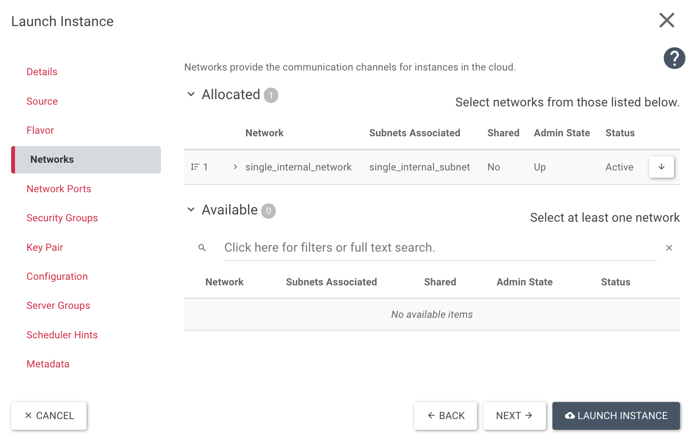

# Schritt 21: Eine Instanz von einem SSD-Volume starten

## Einführung

In den vorherigen Schritten haben Sie bereits eine eigene Instanz erstellt.
In diesem Schritt lernen Sie wie man eine Instanz von einem Volume startet und dafür den SSD-Speicher nutzt.
Auch hier gibt es mehrere Wege, um das zu erreichen. Wir werden in diesem Schritt sowohl das Horizon Dashboard nutzen,
als auch das HEAT-Template aus [Schritt 18](/optimist/guided_tour/step18/) weiter modifizieren.

## Der Weg über das Horizon Dashboard

Loggen Sie sich zunächst wie in
[Schritt 1](/optimist/guided_tour/step01/) erklärt, ins Horizon Dashboard ein.
Wechseln Sie links in der Seitenleiste auf
*Project → Volumes → Volumes*  und klicken rechts auf *+ Create Volume*.


 Machen Sie in dem sich öffnenden Fenster die folgenden Eingaben:

- `Volume Name`: Vergeben Sie den Namen des *Volumes*. Dieser ist frei wählbar. Im Beispiel wird nach der Auswahl des Images automatisch *Ubuntu 16.04 Xenial Xerus - Latest* eingetragen.
- `Description`: In diesem Feld können Sie, je nach Bedarf, eine Beschreibung hinzufügen. In unserem Beispiel verwenden wir keine Beschreibung.
- `Volume Source`: Hier können Sie zwischen *Image* und *No source, empty image* wählen. Für unser Beispiel nutzen wir *Image*.
- `Use image as a source`: Sie können ein beliebiges Image nutzen. Im Beispiel verwenden wir *Ubuntu 16.04 Xenial Xerus - Latest (276.2 MB)*.
- `Type`: Hier können Sie zwischen *high-iops*, *low-iops* und *default* wählen. Da wir SSD-Speicher nutzen wollen, wählen Sie *high-iops* aus.
- `Size`: In diesem Feld bestimmen Sie die Größe des Volumes. Bei unseren Flavors sind es 20 GiB, daher nutzen wir dies auch für unser Beispiel.
- `Availability Zone`: Hier können Sie zwischen drei Optionen *Any Availability Zone*, *es1* oder *ix1* wählen und die entsprechende Zone festlegen. Im Beispiel nutzen wir *ix1*.


Klicken Sie anschließend auf *Create Volume*.

Nachdem Horizon das Volume korrekt erstellt hat, sollte es in etwa so aussehen:


Um eine neue Instanz von diesem Volume zu starten, können Sie rechts auf den Pfeil nach unten neben *Edit Volume*
klicken und dann auf *Launch as Instance*. Alternativ dazu können Sie links in der Seitenleiste zu
*Compute → Instances* wechseln und auf *Launch Instance* klicken.

Geben Sie in dem sich öffnenden Fenster der Instanz einen Namen (Instance Name),
wählen dieselbe *Availability Zone* wie weiter oben,
also *ix1*, und wechseln links auf *Source*.


Unter *Source* wählen Sie *Volume* als *Select Boot Source* aus und klicken neben dem erstellten Volume auf den Pfeil nach oben.


Klicken Sie nun links auf *Flavor* und wählen einen der möglichen Flavors aus. Klicken Sie dazu neben dem gewünschten Flavor auf den Pfeil nach oben.


Wählen Sie nun links über den Reiter *Networks* das Netzwerk für die VM aus. Klicken Sie auch hier neben dem gewünschten Netzwerk auf den Pfeil nach oben.



Damit sind alle wichtigen Einstellungen vorhanden und Sie können die Instanz mit *Launch Instance* starten.
Falls nötig, können Sie der Instanz noch eigene Security Groups und/oder
Key Pairs hinzufügen.

## Der Weg über HEAT

Wie bereits im Vorwort erwähnt, nutzen wir unser HEAT-Template aus [Schritt 18](/optimist/guided_tour/ste18/).
Dieses Template startet bereits eine Instanz.
Damit diese nun aber ein SSD-Volume nutzt, bedarf es einiger Änderungen.
Fügen Sie zunächst Ihren Parametern noch die "availability_zone" hinzu:

```yaml
heat_template_version: 2014-10-16

parameters:
    key_name:
        type: string
    public_network_id:
        type: string
        default: provider
 availability_zone:
  type: string
  default: ix1
```

Als nächstes müssen Sie am Ende des Templates einen eigenen Punkt *boot_ssd* für das Volume hinzufügen:

```yaml
 boot_ssd:
        type: OS::Cinder::Volume
        properties:
            name: boot_ssd
            size: 20
            availability_zone: { get_param: availability_zone }
            volume_type: high-iops
            image: "Ubuntu 16.04 Xenial Xerus - Latest"
```

Nun haben Sie einen Parameter hinzugefügt und nutzten diesen auch direkt in dem neu erstellten Boot-Volume.
Damit die Instanz auch vom Volume startet, müssenSie den Punkt "Instanz" in Ihrem HEAT-Template überarbeiten.
Dort können Sie den Punkt *image* entfernen (im Beispiel ist er mit # auskommentiert),
da dieser ja über das Volume bereitgestellt wird.
    Fügen Sie nun noch die `availability_zone` , einen Namen  `name`,
das Netzwerk `networks` und das Volume *block_device_mapping* hinzu:

```yaml
    Instanz:
        type: OS::Nova::Server
        properties:
   name: SSD-Test
   availability_zone: { get_param: availability_zone }
            key_name: { get_param: key_name }
            #image: Ubuntu 16.04 Xenial Xerus - Latest
            flavor: m1.small
   networks:
                - port: { get_resource: Port }
            block_device_mapping: [
                { device_name: "vda",
                  volume_id: { get_resource: boot_ssd },
                  delete_on_termination: "true" } ]
```

Damit ist Ihr HEAT-Template für diesen Schritt fertig und sollte so aussehen:

```yaml
heat_template_version: 2014-10-16

parameters:
    key_name:
        type: string
    public_network_id:
        type: string
        default: provider
 availability_zone:
  type: string
  default: ix1

resources:

    Instanz:
        type: OS::Nova::Server
        properties:
   name: SSD-Test
   availability_zone: { get_param: availability_zone }
            key_name: { get_param: key_name }
            #image: Ubuntu 16.04 Xenial Xerus - Latest
            flavor: m1.small
   networks:
                - port: { get_resource: Port }
            block_device_mapping: [
                { device_name: "vda",
                  volume_id: { get_resource: boot_ssd },
                  delete_on_termination: "true" } ]

    Netzwerk:
        type: OS::Neutron::Net
            properties:
            name: BeispielNetzwerk

    Port:
        type: OS::Neutron::Port
        properties:
            network: { get_resource: Netzwerk }

    Router:
        type: OS::Neutron::Router
        properties:
            external_gateway_info: { "network": { get_param: public_network_id }
            name: BeispielRouter

    Subnet:
        type: OS::Neutron::Subnet
        properties:
            name: BeispielSubnet
            dns_nameservers:
                - 8.8.8.8
                - 8.8.4.4
            network: { get_resource: Netzwerk }
            ip_version: 4
            cidr: 10.0.0.0/24
            allocation_pools:
                - { start: 10.0.0.10, end: 10.0.0.250 }

    Router_Subnet_Bridge:
        type: OS::Neutron::RouterInterface
        depends_on: Subnet
        properties:
            router: { get_resource: Router }
            subnet: { get_resource: Subnet }

    Floating_IP:
        type: OS::Neutron::FloatingIP
        properties:
            floating_network: { get_param: public_network_id }
            port_id: { get_resource: Port }

    Sec_SSH:
        type: OS::Neutron:SecurityGroup
        properties:
            description: Diese Security Group erlaubt den eingehenden SSH-Traffic über Port22 und ICMP
            name: Ermöglicht SSH (Port22) und ICMP
            rules:
                - { direction: ingress, remote_ip_prefix: 0.0.0.0/0, port_range_min: 22, port_range_max: 22, protocol: tcp }
                - { direction: ingress, remote_ip_prefix: 0.0.0.0/0, protocol: icmp }


 boot_ssd:
        type: OS::Cinder::Volume
        properties:
            name: boot_ssd
            size: 20
            availability_zone: { get_param: availability_zone }
            volume_type: high-iops
            image: "Ubuntu 16.04 Xenial Xerus - Latest"
```

## Zusammenfassung

In diesem Schritt haben Sie gelernt, eine Instanz auch von einem Volume zu starten
und gleichzeitig einen schnellen SSD Speicher zu nutzen. Außerdem haben Sie Ihre HEAT-Kenntnisse aufgefrischt
und ein Volume mit eingebunden.
