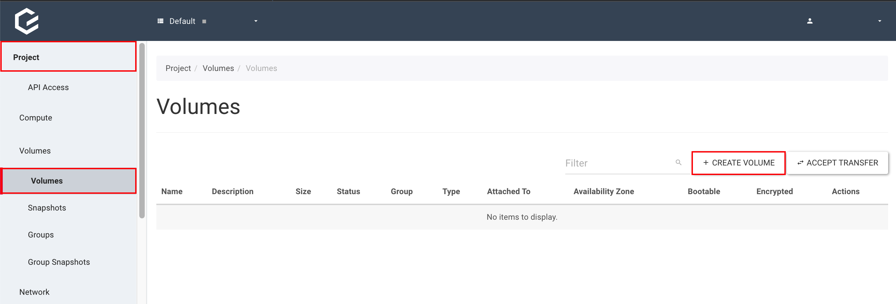
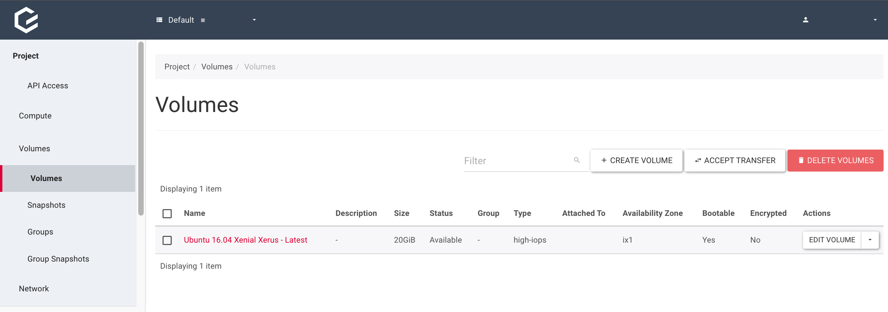
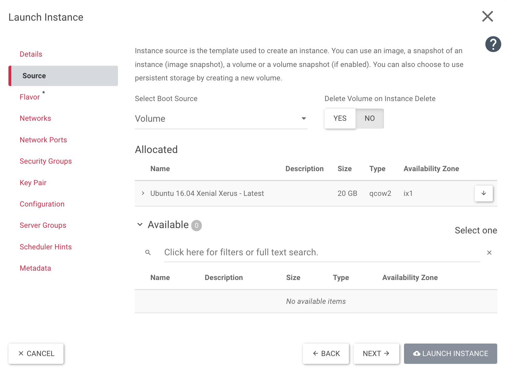

Step 21: Start a VM via an SSD volume
=========================================

Start
-------

Previously we've created a vm from scratch and have also learned some basics about HEAT.
In this step we are going to boot a vm from a SSD volume. There are different ways to achieve that. 
For this example, we will use the Horizon(Dashboard) and also modify the HEAT-Template from [Step 18](/optimist/guided_tour/step18).

The Horizon(Dashboard) way
-----

To get started, we need to login to the Horizon, as we described in "Step 1: The Horizon(Dashboard)".
Now we will create a new volume via Project → Volumes → Volumes and a click on "+ Create Volume".



We need to fill in some information in the new overlay, a description for all required points are below. After filling out the form, click on 'Create Volume'

-   Volume Name: Defines the name of the volume. In our example it will be pre filled with "Ubuntu 16.04 Xenial Xerus - Latest".
-   Description: If needed we can add a short description. In our example, it's empty.
-   Volume Source: We can choose between "Image" and "No source, empty image". Please use "Image".
-   Use image as a source: Any image can be used and we will choose "Ubuntu 16.04 Xenial Xerus - Latest (276.2 MB)" .
-   Type: Three options are possible "high-iops", "low-iops" or "default". To use the ssd storage, we need to choose "high-iops".
-   Size: You can define the size of the volume, we use 20 GiB
-   Availability Zone: Again three possible options "Any Availability Zone", "es1" or "ix1". Use ix1 


After volume creation, it should look like this:



There are two options to start a vm now. 
The first one is to click on the down-arrow next to "Edit Volume" as you can see in the picture above and click on "Launch as Instance". 

There will be a new overlay where the name (Instance Name) and the availability zone can be choosen. Please use the same availability zone as for the image.(ix1) 


Switch to "Source" and choose "Volume" for "Select Boot Source" and click on the up-arrow next to the available volume.



Switch to "Flavor" and choose one of the available flavors with a click on the up-arrow.


As next step we need to choose a network in "Networks". Use one of your networks and click on the up-arrow next to it.


Now all needed settings are set and the vm can be started via "Launch Instance". 
If needed you can add own security groups(Security Groups) and/or key pairs(Key Pair).

The HEAT way
---------------

As explained at the start, we will use the HEAT Template from Step 18.
It will start a vm anyways, so now we need to adapt it, that it will create a ssd volume and boot from it.
At first we will a new parameter "availability_zone":

```yaml
heat_template_version: 2014-10-16
  
parameters:
    key_name:
        type: string
    public_network_id:
        type: string
        default: provider
	availability_zone:
		type: string
		default: ix1
```

Now add "boot_ssd" at the end of our template:

```yaml
	boot_ssd:
        type: OS::Cinder::Volume
        properties:
            name: boot_ssd
            size: 20
            availability_zone: { get_param: availability_zone }
            volume_type: high-iops
            image: "Ubuntu 16.04 Xenial Xerus - Latest"
```

For now we have added a new parameter and will use this already in our new volume.
To start the vm from the volume, we need to edit "Instanz" in our template. 
We can delete or comment out "image", because it's already on our volume. 
Now we add "availability_zone", "name", "networks" and "block_device_mapping":

```yaml
    Instanz:
        type: OS::Nova::Server
        properties:
			name: SSD-Test
			availability_zone: { get_param: availability_zone }
            key_name: { get_param: key_name }
            #image: Ubuntu 16.04 Xenial Xerus - Latest
            flavor: m1.small
			networks:
                - port: { get_resource: Port }
            block_device_mapping: [
                { device_name: "vda",
                  volume_id: { get_resource: boot_ssd },
                  delete_on_termination: "true" } ]
```

The template is finished and should look like this:

```yaml
heat_template_version: 2014-10-16
  
parameters:
    key_name:
        type: string
    public_network_id:
        type: string
        default: provider
	availability_zone:
		type: string
		default: ix1
 
resources:
 
    Instanz:
        type: OS::Nova::Server
        properties:
			name: SSD-Test
			availability_zone: { get_param: availability_zone }
            key_name: { get_param: key_name }
            #image: Ubuntu 16.04 Xenial Xerus - Latest
            flavor: m1.small
			networks:
                - port: { get_resource: Port }
            block_device_mapping: [
                { device_name: "vda",
                  volume_id: { get_resource: boot_ssd },
                  delete_on_termination: "true" } ]
 
    Netzwerk:
        type: OS::Neutron::Net
            properties:
            name: BeispielNetzwerk
 
    Port:
        type: OS::Neutron::Port
        properties:
            network: { get_resource: Netzwerk }
 
    Router:
        type: OS::Neutron::Router
        properties:
            external_gateway_info: { "network": { get_param: public_network_id }
            name: BeispielRouter
 
    Subnet:
        type: OS::Neutron::Subnet
        properties:
            name: BeispielSubnet
            dns_nameservers:
                - 8.8.8.8
                - 8.8.4.4
            network: { get_resource: Netzwerk }
            ip_version: 4
            cidr: 10.0.0.0/24
            allocation_pools:
                - { start: 10.0.0.10, end: 10.0.0.250 }
 
    Router_Subnet_Bridge:
        type: OS::Neutron::RouterInterface
        depends_on: Subnet
        properties:
            router: { get_resource: Router }
            subnet: { get_resource: Subnet }
 
    Floating_IP:
        type: OS::Neutron::FloatingIP
        properties:
            floating_network: { get_param: public_network_id }
            port_id: { get_resource: Port }
 
    Sec_SSH:
        type: OS::Neutron:SecurityGroup
        properties:
            description: Diese Security Group erlaubt den eingehenden SSH-Traffic über Port22 und ICMP
            name: Ermöglicht SSH (Port22) und ICMP
            rules:
                - { direction: ingress, remote_ip_prefix: 0.0.0.0/0, port_range_min: 22, port_range_max: 22, protocol: tcp }
                - { direction: ingress, remote_ip_prefix: 0.0.0.0/0, protocol: icmp }


	boot_ssd:
        type: OS::Cinder::Volume
        properties:
            name: boot_ssd
            size: 20
            availability_zone: { get_param: availability_zone }
            volume_type: high-iops
            image: "Ubuntu 16.04 Xenial Xerus - Latest"
```

Conclusion
---------

We've learned to start an instance from a volume and can use SSD storage.
In addition to this, we have refreshed our heat knowledge and learned how to include a volume. 
