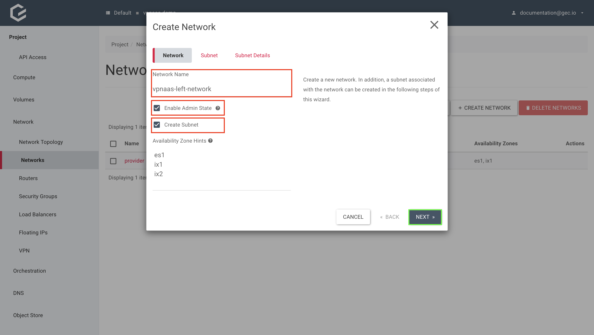
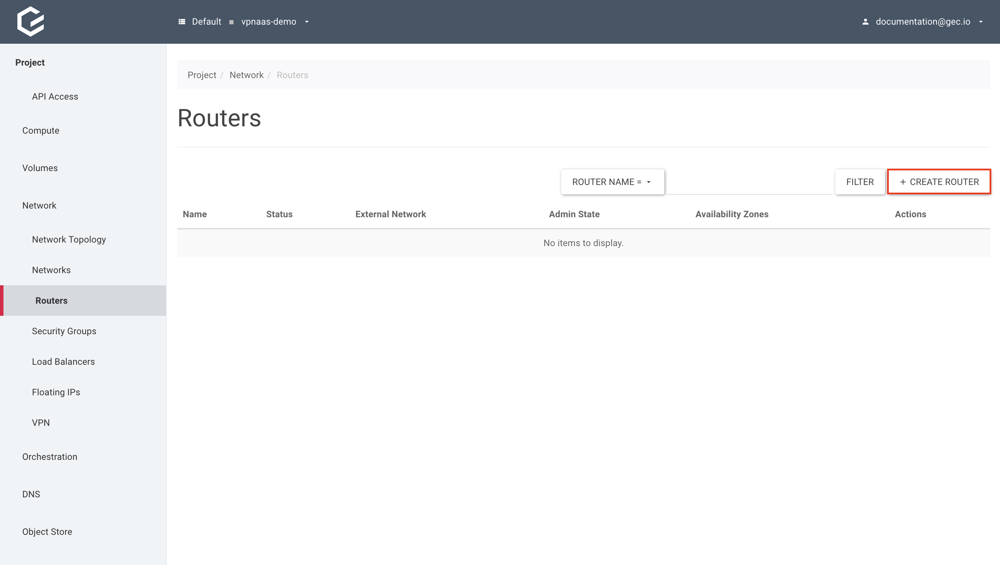
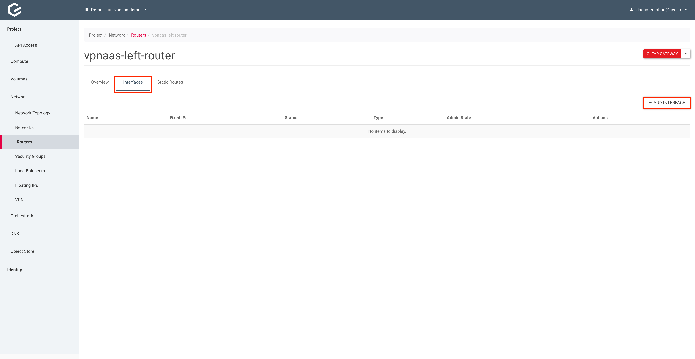
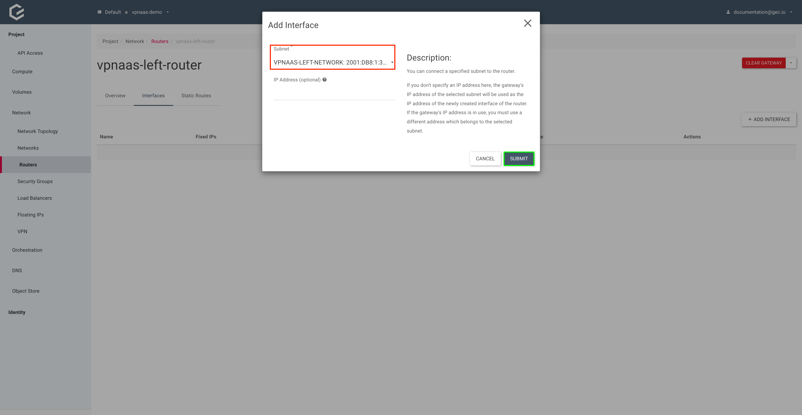
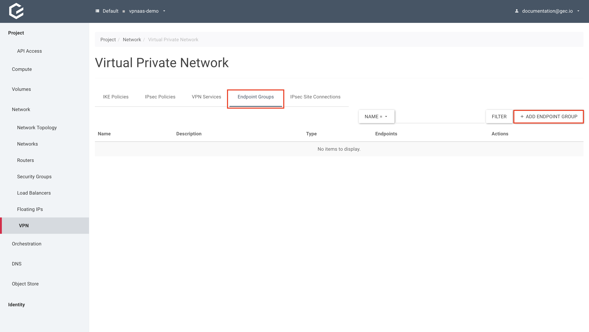
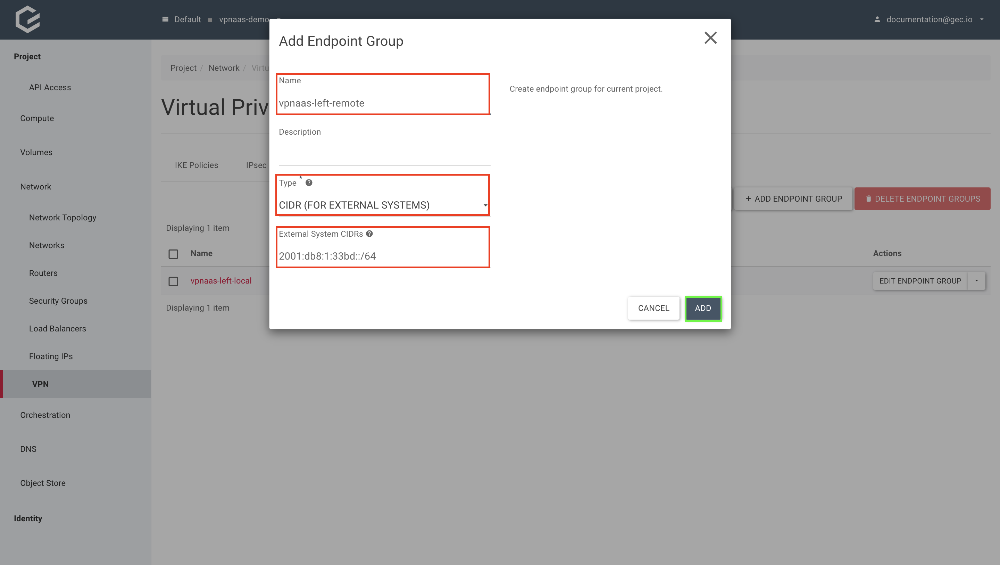
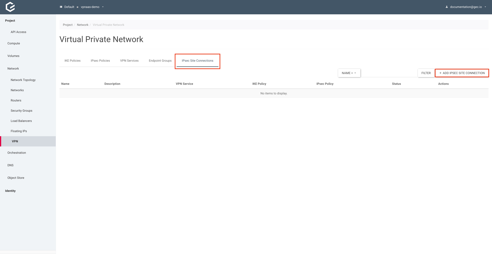
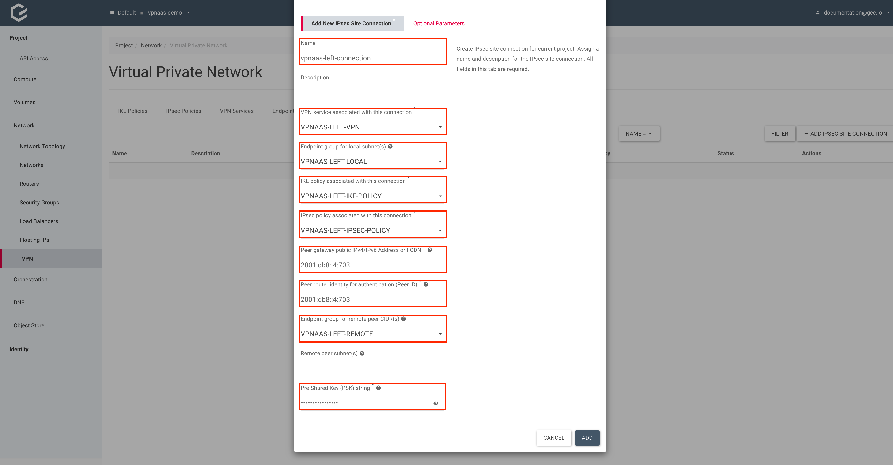

# VPN as a Service (VPNaaS)

OpenStack unterstützt bei Bedarf Site-to-Site VPNs as a Service.
Damit können Benutzer zwei private Netzwerke miteinander verbinden. Dazu werden von OpenStack voll funktionale IPsec VPNs innerhalb eines Projekts konfiguriert, ohne dass weitere netzwerkfähige VMs benötigt werden.

## Anlegen eines Site-to-Site IPSec VPN

### Erzeugen von "linken" und "rechten" Netzwerken und Subnetzen

Bevor wir ein VPN anlegen können, benötigen wir zwei getrennte Netzwerke, die miteinander verbunden werden sollen. In dieser Anleitung erzeugen wir diese Netzwerke in zwei verschiedenen OpenStack Projekten und nennen sie "links" (left) und "rechts" (right).
Die folgenden Schritte müssen für beide Netzwerke ("links" und "rechts") durchgeführt werden, damit die zwei verschiedenen OpenStack Cluster miteinander verbunden werden können.
Der Einfachheit halber zeigen wir in dieser Anleitung nur, wie wir das linke Netzwerk erzeugen. Die Schritte für das rechte Netzwerk sind bis auf den Namen und das Subnetz-Präfix für OpenStack identisch.
In diesem Beispiel verwenden wir das Subnetz-Präfix `2001:db8:1:33bc::/64` für das linke Netzwerk und `2001:db8:1:33bd::/64` für das rechte Netzwerk.

**Falls Sie bereits über zwei Netzwerke verfügen, die Sie über einen Site-to-Site VPN verbinden möchten, können Sie den Schritt [Erzeugen von IKE und IPSec Policies auf beiden Seiten](#Create-IKE-and-IPSec-policies-on-both-sides) überspringen**.

#### Verwenden von Horizon (GUI)

1. Erzeugen Sie das linke Netzwerk mit einem neuen Subnetz.

Navigieren Sie innerhalb Ihres Projekts zu _Network → Networks_ und klicken Sie auf _Create Network_.

[](https://optimist.gec.io/project/networks/)

Geben Sie dem neuen Netzwerk einen Namen und wählen Sie _Enable Admin State_ , um das Netzwerk zu aktivieren. Wählen Sie anschließend _Create Subnet_ aus, um das Netzwerk und Subnetz in einem Schritt zu erzeugen. Klicken Sie danach auf _Next_.

[](https://optimist.gec.io/project/networks/)

Geben Sie Ihrem neuen Netzwerk-Subnetz einen Namen und wählen Sie _Enter Network Address manually_ aus. Falls Sie Ihr eigenes Subnetz verwenden möchten, geben Sie Ihr gewünschtes Subnetz in _Network Address_ ein.
Falls Sie ein Subnetz von einem vordefinierten Pool verwenden möchten, wählen Sie _Allocate Network Address from a pool_ und wählen Sie einen Pool aus. Klicken Sie anschließend auf _Next_.

**Für Dokumentationszwecke verwenden wir die vorher genannten Präfixe.**

[](https://optimist.gec.io/project/networks/)

Wählen Sie _Enable DHCP_ und unter _IPv6 Address Configuration Mode_ DHCPV6 STATEFUL aus. Die Allokationspools werden automatisch erzeugt. Klicken Sie auf _Create_.

[](https://optimist.gec.io/project/networks/)

#### Verwenden von CLI

1. Erzeugen Sie das linke Netzwerk mit dem Befehl `openstack network create`.

```
$ openstack network create vpnaas-left-network
+---------------------------+--------------------------------------+
| Field                     | Value                                |
+---------------------------+--------------------------------------+
| admin_state_up            | UP                                   |
| availability_zone_hints   |                                      |
| availability_zones        |                                      |
| created_at                | 2022-09-12T12:45:42Z                 |
| description               |                                      |
| dns_domain                |                                      |
| id                        | ff7c61f1-4dcb-49bf-be9f-efdcaa1e0aaa |
| ipv4_address_scope        | None                                 |
| ipv6_address_scope        | None                                 |
| is_default                | False                                |
| is_vlan_transparent       | None                                 |
| mtu                       | 1500                                 |
| name                      | vpnaas-left-network                  |
| port_security_enabled     | True                                 |
| project_id                | 281fa14f782e4d4cbfd4e34a121c2680     |
| provider:network_type     | None                                 |
| provider:physical_network | None                                 |
| provider:segmentation_id  | None                                 |
| qos_policy_id             | None                                 |
| revision_number           | 1                                    |
| router:external           | Internal                             |
| segments                  | None                                 |
| shared                    | False                                |
| status                    | ACTIVE                               |
| subnets                   |                                      |
| tags                      |                                      |
| updated_at                | 2022-09-12T12:45:42Z                 |
+---------------------------+--------------------------------------+
```

2. Erzeugen Sie ein neues Subnetz und weisen Sie es mit dem Befehl `openstack subnet create` dem neuen Netzwerk zu.

```
$ openstack subnet create \
  vpnaas-left-network-subnet \
  --subnet-range 2001:db8:1:33bc::/64 --ip-version 6 \
  --network vpnaas-left-network
+----------------------+--------------------------------------------------------+
| Field                | Value                                                  |
+----------------------+--------------------------------------------------------+
| allocation_pools     | 2001:db8:1:33bc::1-2001:db8:1:33bc:ffff:ffff:ffff:ffff |
| cidr                 | 2001:db8:1:33bc::/64                                   |
| created_at           | 2022-09-12T12:47:51Z                                   |
| description          |                                                        |
| dns_nameservers      |                                                        |
| dns_publish_fixed_ip | None                                                   |
| enable_dhcp          | True                                                   |
| gateway_ip           | 2001:db8:1:33bc::                                      |
| host_routes          |                                                        |
| id                   | e217a377-48c7-4c18-93b5-cfd805bde40a                   |
| ip_version           | 6                                                      |
| ipv6_address_mode    | None                                                   |
| ipv6_ra_mode         | None                                                   |
| name                 | vpnaas-left-network-subnet                             |
| network_id           | ff7c61f1-4dcb-49bf-be9f-efdcaa1e0aaa                   |
| project_id           | 281fa14f782e4d4cbfd4e34a121c2680                       |
| revision_number      | 0                                                      |
| segment_id           | None                                                   |
| service_types        |                                                        |
| subnetpool_id        | None                                                   |
| tags                 |                                                        |
| updated_at           | 2022-09-12T12:47:51Z                                   |
+----------------------+--------------------------------------------------------+
```

### Erzeugen des linken und rechten Routers

#### Verwenden von Horizon (GUI)

1. Erzeugen Sie einen Router mit dem Provider-Netzwerk als externes Gateway.

Navigieren Sie innerhalb Ihres Projekts zu _Network → Routers_ und klicken Sie auf _Create Router_.

[](https://optimist.gec.io/project/routers/)

Geben Sie dem neuen Router einen Namen. Wählen Sie _Enable Admin State_, um den Router zu aktivieren. Wählen Sie "PROVIDER" als _External Network_ und klicken Sie auf _Create Router_.

[](https://optimist.gec.io/project/routers/)

#### Verwenden von CLI

1. Erzeugen Sie einen Router mit dem Befehl `openstack router create`.

```
$ openstack router create vpnaas-left-router
+-------------------------+--------------------------------------+
| Field                   | Value                                |
+-------------------------+--------------------------------------+
| admin_state_up          | UP                                   |
| availability_zone_hints |                                      |
| availability_zones      |                                      |
| created_at              | 2022-09-12T12:48:15Z                 |
| description             |                                      |
| enable_ndp_proxy        | None                                 |
| external_gateway_info   | null                                 |
| flavor_id               | None                                 |
| id                      | 052e968a-a63b-4824-b904-eb70c42c53e5 |
| name                    | vpnaas-left-router                   |
| project_id              | 281fa14f782e4d4cbfd4e34a121c2680     |
| revision_number         | 2                                    |
| routes                  |                                      |
| status                  | ACTIVE                               |
| tags                    |                                      |
| tenant_id               | 281fa14f782e4d4cbfd4e34a121c2680     |
| updated_at              | 2022-09-12T12:48:15Z                 |
+-------------------------+--------------------------------------+
```

2. Verwenden Sie den Befehl `openstack router set`, um das Provider-Netzwerk als externes Gateway für den Router anzulegen.

```
$ openstack router set vpnaas-left-router --external-gateway provider
```

### Zuordnen des Subnetzes an den Router

#### Verwenden von Horizon (GUI)

Navigieren Sie innerhalb Ihres Projekts zu _Network → Routers_ und wählen Sie den zuvor erzeugten Router aus.

[](https://optimist.gec.io/project/routers/)

Wählen Sie _Interfaces_ und klicken Sie auf _Add Interface_.

[](https://optimist.gec.io/project/routers/)

Wählen Sie Ihr Subnetz aus und klicken Sie auf _Submit_.

[](https://optimist.gec.io/project/routers/)

#### Verwenden von CLI

Verwenden Sie den Befehl `openstack router add subnet`, um das Subnetz mit dem Router zu verbinden.

```
$ openstack router add subnet vpnaas-left-router vpnaas-left-network-subnet
```

### Erzeugen von IKE und IPSec Policies auf beiden Seiten

Die IKE und IPSec Policies müsssen auf beiden Seiten identisch konfiguriert werden. In dieser Anleitung verwenden wir die folgenden Parameter:

| Parameter               | IKE Policy | IPSec Policy |
| ----------------------- | ---------- | ------------ |
| Authorization algorithm | `SHA256`   | `SHA256`     |
| Encryption algorithm    | `AES-256`  | `AES-256`    |
| Encapsulation mode      | N/A        | `TUNNEL`     |
| IKE Version             | `V2`       | N/A          |
| Perfect Forward Secrecy | `GROUP14`  | `GROUP14`    |
| Transform Protocol      | N/A        | `ESP`        |

#### Verwenden von Horizon (GUI)

1. Erzeugen Sie die IKE Policy.

Navigieren Sie innerhalb Ihres Projekts zu _Network → VPN_, wählen Sie _IKE Policies_ aus und klicken Sie auf _Add IKE Policy_.

[](https://optimist.gec.io/project/vpn/)

Geben Sie Ihrer IKE Policy einen Namen und geben Sie die IKE Policy Parameter ein. Klicken Sie anschließend auf _Add_.

[](https://optimist.gec.io/project/vpn/)

2. Erzeugen Sie die IPSec Policy.

Sie befinden sich noch immer innerhalb von _Network → VPN_. Wählen Sie _IPSec Policies_ aus und klicken Sie auf _Add IPsec Policy_.

[](https://optimist.gec.io/project/vpn/)

Geben Sie Ihrer IPSec Policy einen Namen und geben Sie die IPSec Policy Parameter ein. Klicken Sie anschließend auf _Add_.

[](https://optimist.gec.io/project/vpn/)

#### Verwenden von CLI

1. Erzeugen Sie die IKE Policy mit dem Befehl `openstack vpn ike policy create`.

```
$ openstack vpn ike policy create \
  vpnaas-left-ike-policy \
  --auth-algorithm sha256 \
  --encryption-algorithm aes-256 \
  --ike-version v2 \
  --pfs group14
+-------------------------------+--------------------------------------+
| Field                         | Value                                |
+-------------------------------+--------------------------------------+
| Authentication Algorithm      | sha256                               |
| Description                   |                                      |
| Encryption Algorithm          | aes-256                              |
| ID                            | 561387b8-b5c1-415e-abc9-79ba93dd48ff |
| IKE Version                   | v2                                   |
| Lifetime                      | {'units': 'seconds', 'value': 3600}  |
| Name                          | vpnaas-left-ike-policy               |
| Perfect Forward Secrecy (PFS) | group14                              |
| Phase1 Negotiation Mode       | main                                 |
| Project                       | 281fa14f782e4d4cbfd4e34a121c2680     |
| project_id                    | 281fa14f782e4d4cbfd4e34a121c2680     |
+-------------------------------+--------------------------------------+
```

2. Erzeugen Sie die IPSec Policy mit dem Befehl `openstack vpn ipsec policy create`.

```
$ openstack vpn ipsec policy create \
  vpnaas-left-ipsec-policy \
  --auth-algorithm sha256 \
  --encryption-algorithm aes-256 \
  --pfs group14 \
  --transform-protocol esp
+-------------------------------+--------------------------------------+
| Field                         | Value                                |
+-------------------------------+--------------------------------------+
| Authentication Algorithm      | sha256                               |
| Description                   |                                      |
| Encapsulation Mode            | tunnel                               |
| Encryption Algorithm          | aes-256                              |
| ID                            | 553a600e-f39d-47a0-9550-97f2b4033685 |
| Lifetime                      | {'units': 'seconds', 'value': 3600}  |
| Name                          | vpnaas-left-ipsec-policy             |
| Perfect Forward Secrecy (PFS) | group14                              |
| Project                       | 281fa14f782e4d4cbfd4e34a121c2680     |
| Transform Protocol            | esp                                  |
| project_id                    | 281fa14f782e4d4cbfd4e34a121c2680     |
+-------------------------------+--------------------------------------+
```

### Erzeugen der VPN Services auf beiden Seiten

#### Verwenden von Horizon (GUI)

Navigieren Sie innerhalb Ihres Projekts zu _Network → VPN_. Wählen Sie _VPN Services_ aus und klicken Sie auf _Add VPN Service_.

[](https://optimist.gec.io/project/vpn/)

Geben Sie Ihrem VPN Service einen Namen. Wählen Sie Ihren Router aus und selektieren Sie _Enable Admin State_. Ein Subnetz wird nicht benötigt, da wir die Endpoint Gruppen verwenden. Klicken Sie anschließend auf _Add_.

[](https://optimist.gec.io/project/vpn/)

#### Verwenden von CLI

Verwenden Sie den Befehl `openstack vpn service create`, um den VPN Service zu erzeugen.

```
$ openstack vpn service create vpnaas-left-vpn --router vpnaas-left-router
+----------------+--------------------------------------+
| Field          | Value                                |
+----------------+--------------------------------------+
| Description    |                                      |
| Flavor         | None                                 |
| ID             | cc258fd7-0e87-4058-ad7d-355f32c1ab5e |
| Name           | vpnaas-left-vpn                      |
| Project        | 281fa14f782e4d4cbfd4e34a121c2680     |
| Router         | 052e968a-a63b-4824-b904-eb70c42c53e5 |
| State          | True                                 |
| Status         | PENDING_CREATE                       |
| Subnet         | None                                 |
| external_v4_ip | 185.116.244.85                       |
| external_v6_ip | 2a00:c320:1003::23a                  |
| project_id     | 281fa14f782e4d4cbfd4e34a121c2680     |
+----------------+--------------------------------------+
```

### Erzeugen der Endpoint Gruppen

{: .warning }

Bei Verwendung mehrerer Subnetze muss sichergestellt werden, dass der VPN-Endpunkt das Routing mehrerer Subnetze über dieselbe Verbindung unterstützt. Während OpenStack dies tut, müssen für Implementierungen, welche dies nicht unterstützen, mehrere Endpunktgruppen erstellt werden, eine für jedes Subnetz.

#### Verwenden von Horizon (GUI)

1. Erzeugen Sie die lokale Endpoint Gruppe für die linke Seite.

Navigieren Sie innerhalb Ihres Projekts zu _Network → VPN_. Wählen Sie _Endpoint Groups_ aus und klicken Sie auf _Add Endpoint Group_.

[](https://optimist.gec.io/project/vpn/)

Geben Sie Ihrer Endpoint Gruppe einen Namen. Wählen Sie als Typ _Subnet_ und wählen Sie unter _Local System Subnets_ Ihr Subnetz aus. Klicken Sie anschließend auf _Add_.

[](https://optimist.gec.io/project/vpn/)

2. Erzeugen Sie die Peer Endpoint Gruppe für die linke Seite.

Sie befinden sich noch immer innerhalb von _Network → VPN_ und _Endpoint Groups_. Klicken Sie erneut auf _Add Endpoint Group_.

Geben Sie Ihrer Endpoint Gruppe einen Namen. Wählen Sie den Typ _CIDR_ und geben Sie das Subnetz für die rechte Seite ein. Klicken Sie anschließend auf _Add_.

[](https://optimist.gec.io/project/vpn/)

#### Verwenden von CLI

1. Verwenden Sie den Befehl `openstack vpn endpoint group create`, um die lokale Endpoint Gruppe für die linke Seite zu erzeugen.

```
$ openstack vpn endpoint group create \
  vpnaas-left-local \
  --type subnet \
  --value vpnaas-left-network-subnet
+-------------+------------------------------------------+
| Field       | Value                                    |
+-------------+------------------------------------------+
| Description |                                          |
| Endpoints   | ['e217a377-48c7-4c18-93b5-cfd805bde40a'] |
| ID          | 949ccc53-5dc6-457d-95bf-278fdf9a3e5d     |
| Name        | vpnaas-left-local                        |
| Project     | 281fa14f782e4d4cbfd4e34a121c2680         |
| Type        | subnet                                   |
| project_id  | 281fa14f782e4d4cbfd4e34a121c2680         |
+-------------+------------------------------------------+
```

2. Verwenden Sie erneut den Befehl `openstack vpn endpoint group create`, um die Peer Endpoint Gruppe für die linke Seite zu erzeugen.

```
$ openstack vpn endpoint group create \
  vpnaas-left-remote \
  --type cidr \
  --value  2001:db8:1:33bd::/64
+-------------+--------------------------------------+
| Field       | Value                                |
+-------------+--------------------------------------+
| Description |                                      |
| Endpoints   | ['2001:db8:1:33bd::/64']             |
| ID          | 9146346d-1306-4b03-a3ce-04ee51832ed8 |
| Name        | vpnaas-left-remote                   |
| Project     | 281fa14f782e4d4cbfd4e34a121c2680     |
| Type        | cidr                                 |
| project_id  | 281fa14f782e4d4cbfd4e34a121c2680     |
+-------------+--------------------------------------+
```

### Erzeugen der Site-Verbindungen

{: .warning }

Wie auch bei den Endpunktgruppen müssen Sie, wenn Ihr VPN-Endpunkt das Routing mehrerer Subnetze über dieselbe Verbindung nicht unterstützt, mehrere Site-Verbindungen erstellen, eine für jedes Subnetz/Endpunktgruppe.

#### Verwenden von Horizon (GUI)

Navigieren Sie innerhalb Ihres Projekts zu _Network → VPN_. Wählen Sie _IPSec Site Connections_ aus und klicken Sie auf _Add IPSec Site Connection_.

[](https://optimist.gec.io/project/vpn/)

Geben Sie Ihrer Verbindung einen Namen. Wählen Sie den vorher erzeugten VPN Service, die lokale Endpoint Guppe und die IKE und IPSec Policy, den Pre-Shared Key, die Peer IP und die Router Identity.
In dieser Anleitung nutzen wir `2001:db8::4:703` als IP Addresse des rechten Routers.

[](https://optimist.gec.io/project/vpn/)

#### Verwenden von CLI

Verwenden Sie den Befehl `openstack vpn ipsec site connection create`, um den VPN Service zu erzeugen.

```
$ openstack vpn ipsec site connection create \
  vpnaas-left-connection \
  --vpnservice vpnaas-left-vpn \
  --ikepolicy vpnaas-left-ike-policy \
  --ipsecpolicy vpnaas-left-ipsec-policy \
  --local-endpoint-group vpnaas-left-local \
  --peer-address 2001:db8::4:703 \
  --peer-id 2001:db8::4:703 \
  --peer-endpoint-group vpnaas-left-remote \
  --psk 1gHAsAeR8lFEDDu7
+--------------------------+----------------------------------------------------+
| Field                    | Value                                              |
+--------------------------+----------------------------------------------------+
| Authentication Algorithm | psk                                                |
| Description              |                                                    |
| ID                       | d81dbe28-ccda-4ee3-ba96-145fadc74e0f               |
| IKE Policy               | 561387b8-b5c1-415e-abc9-79ba93dd48ff               |
| IPSec Policy             | 553a600e-f39d-47a0-9550-97f2b4033685               |
| Initiator                | bi-directional                                     |
| Local Endpoint Group ID  | 949ccc53-5dc6-457d-95bf-278fdf9a3e5d               |
| Local ID                 |                                                    |
| MTU                      | 1500                                               |
| Name                     | vpnaas-left-connection                             |
| Peer Address             | 2001:db8::4:703                                    |
| Peer CIDRs               |                                                    |
| Peer Endpoint Group ID   | 9146346d-1306-4b03-a3ce-04ee51832ed8               |
| Peer ID                  | 2001:db8::4:703                                    |
| Pre-shared Key           | 1gHAsAeR8lFEDDu7                                   |
| Project                  | 281fa14f782e4d4cbfd4e34a121c2680                   |
| Route Mode               | static                                             |
| State                    | True                                               |
| Status                   | PENDING_CREATE                                     |
| VPN Service              | cc258fd7-0e87-4058-ad7d-355f32c1ab5e               |
| dpd                      | {'action': 'hold', 'interval': 30, 'timeout': 120} |
| project_id               | 281fa14f782e4d4cbfd4e34a121c2680                   |
+--------------------------+----------------------------------------------------+
```
