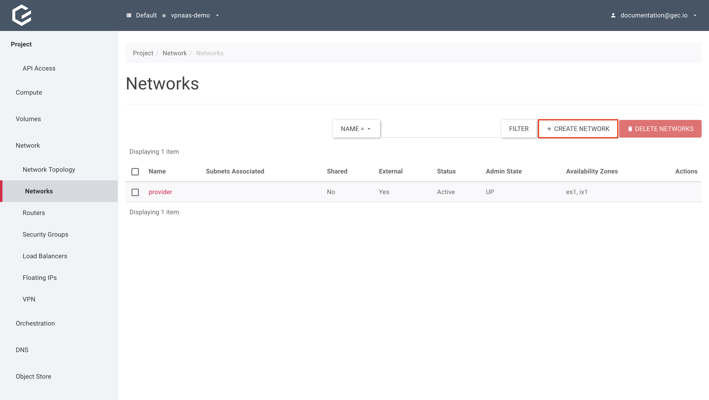
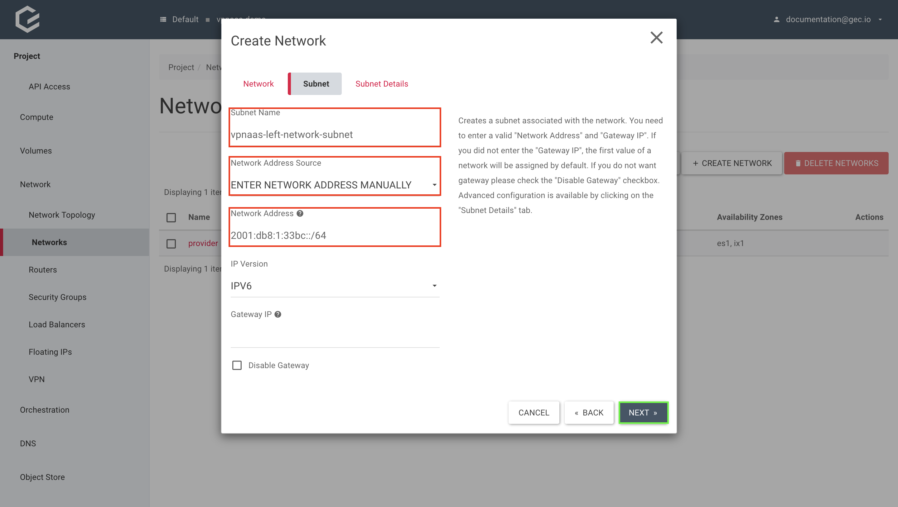
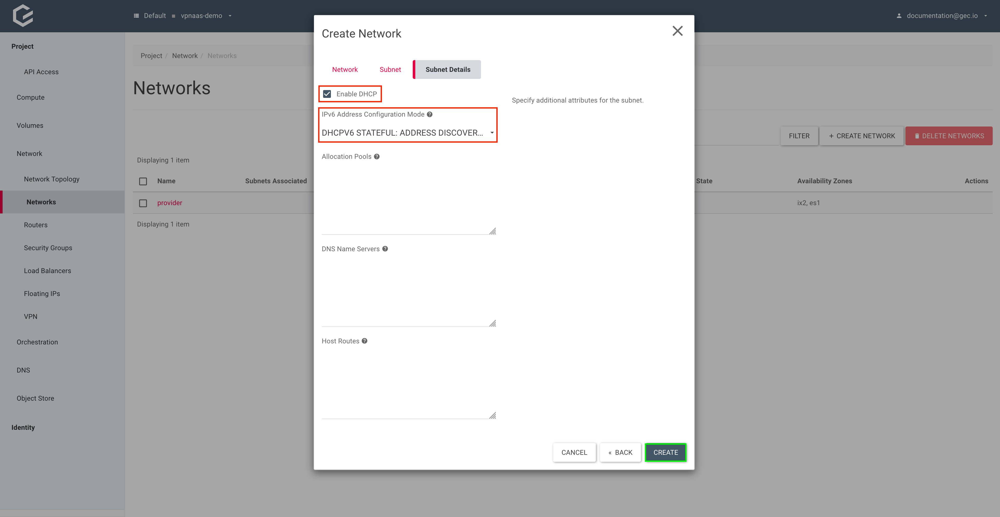
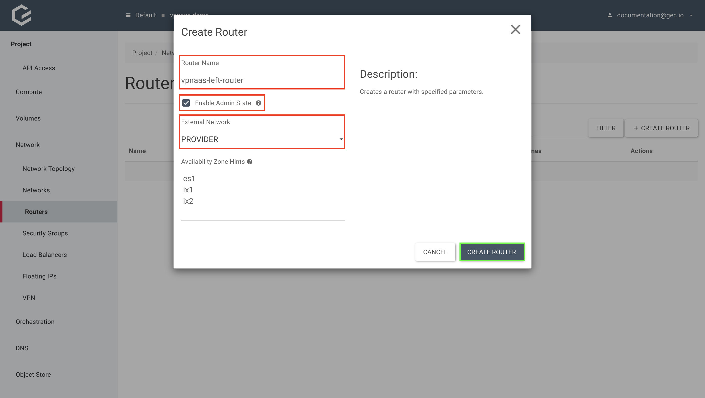
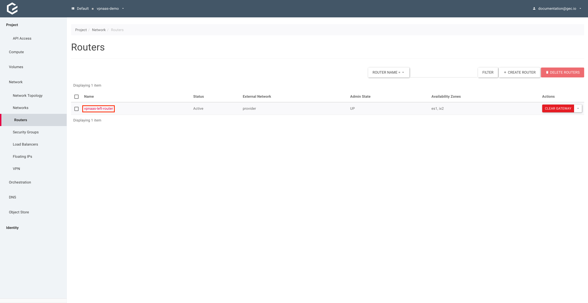
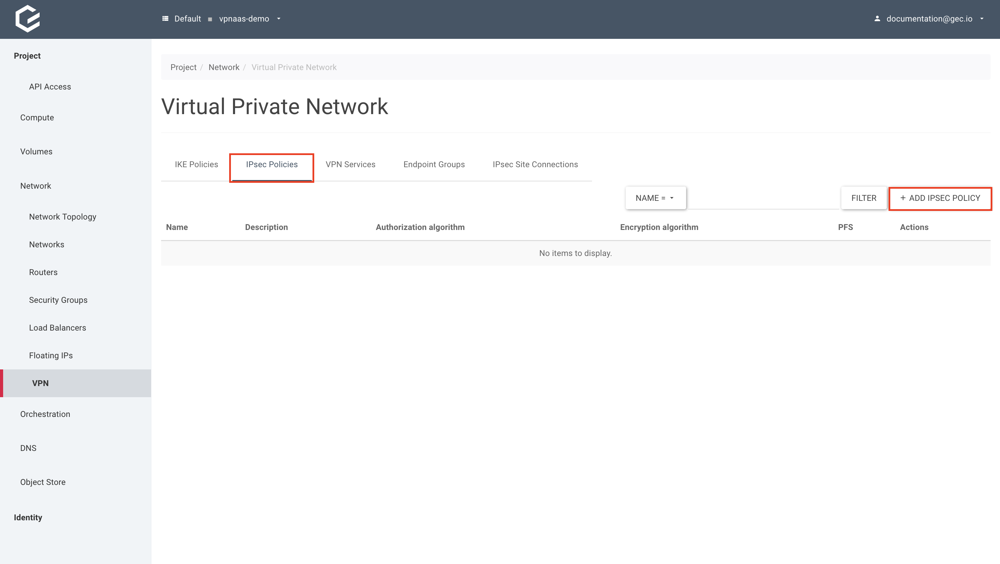
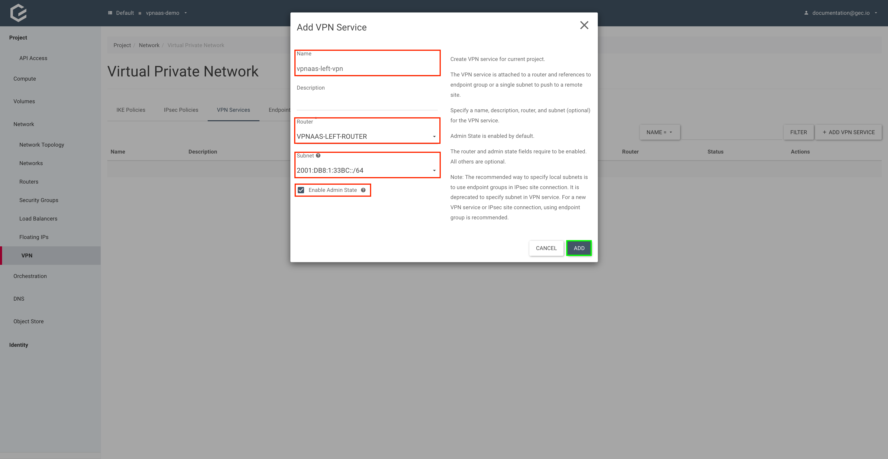
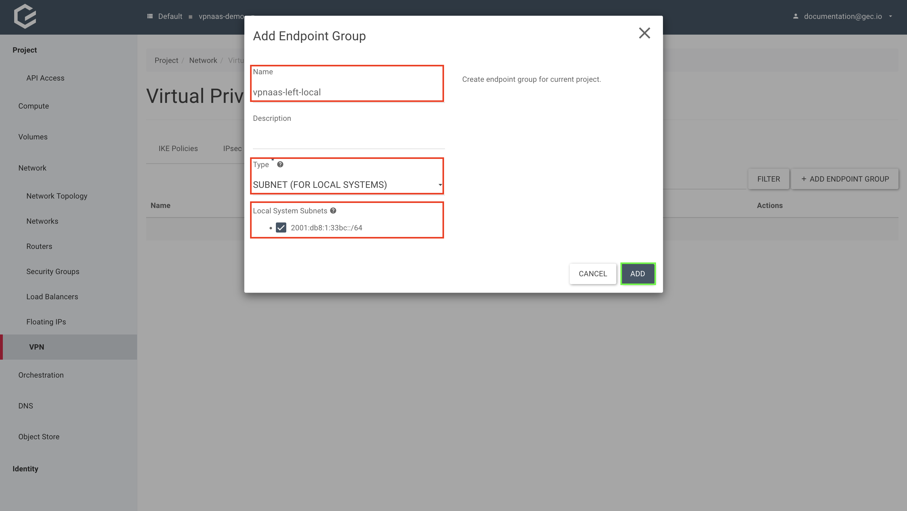

# VPN as a Service (VPNaaS)

OpenStack supports on demand Site-to-Site VPNs as a service.
This allows the user to connect two private networks to each other. To achieve this, OpenStack will configure a fully functional IPsec VPN within a project, without the need for additional networking VMs.

## Setting up a Site-to-Site IPSec VPN

### Create left and right networks and subnets

Before we can create a VPN, we need two separate networks to connect to each other. For this guide, we will create these networks in two different OpenStack projects which will be referred to as "left" and "right".
The following steps have to be repeated for both networks ("left" and "right"), assuming you want to connect two different OpenStack clusters.
For the sake of simplicity, this guide will only demonstrate how to create the left network. For OpenStack, the steps to create the right network are exactly the same with exception to naming and subnet prefix
In this example, we will be using the subnet prefix `2001:db8:1:33bc::/64` for the left network and `2001:db8:1:33bd::/64` for the right.

**If you already have two networks you would like to connect via Site-to-Site VPN, you can skip to [creating IKE and IPSec policies](#Create-IKE-and-IPSec-policies-on-both-sides)**.

#### Using Horizon (GUI)

1. Create the left network with a new subnet.

Within your project, navigate to _Network → Networks_ and click _Create Network_.

[](https://dashboard.optimist.innovo.cloud/project/networks/)

Give your new network a name, select _Enable Admin State_ to enable the network and _Create Subnet_ to create the network and subnet all in one step. Click _Next_.

[](https://dashboard.optimist.innovo.cloud/project/networks/)

Assign a name to your new network subnet, select _Enter Network Address manually_ and enter your desired subnet within _Network Address_, if you would like to use your own subnet.
To use a subnet from a predefined pool instead, select _Allocate Network Address from a pool_ and pick a pool. Click _Next_.

**For documentation purposes, we will be using our own previously mentioned prefixes.**

[](https://dashboard.optimist.innovo.cloud/project/networks/)

Select _Enable DHCP_ and _IPv6 Address Configuration Mode_ "DHCPV6 STATEFUL". Allocation pools will be generated automatically. Click _Create_.

[](https://dashboard.optimist.innovo.cloud/project/networks/)

#### Using the CLI

1. Create the left network using the `openstack network create` command.

```
$ openstack network create vpnaas-left-network
+---------------------------+--------------------------------------+
| Field                     | Value                                |
+---------------------------+--------------------------------------+
| admin_state_up            | UP                                   |
| availability_zone_hints   |                                      |
| availability_zones        |                                      |
| created_at                | 2022-09-12T12:45:42Z                 |
| description               |                                      |
| dns_domain                |                                      |
| id                        | ff7c61f1-4dcb-49bf-be9f-efdcaa1e0aaa |
| ipv4_address_scope        | None                                 |
| ipv6_address_scope        | None                                 |
| is_default                | False                                |
| is_vlan_transparent       | None                                 |
| mtu                       | 1500                                 |
| name                      | vpnaas-left-network                  |
| port_security_enabled     | True                                 |
| project_id                | 281fa14f782e4d4cbfd4e34a121c2680     |
| provider:network_type     | None                                 |
| provider:physical_network | None                                 |
| provider:segmentation_id  | None                                 |
| qos_policy_id             | None                                 |
| revision_number           | 1                                    |
| router:external           | Internal                             |
| segments                  | None                                 |
| shared                    | False                                |
| status                    | ACTIVE                               |
| subnets                   |                                      |
| tags                      |                                      |
| updated_at                | 2022-09-12T12:45:42Z                 |
+---------------------------+--------------------------------------+
```

2. Create a new subnet and allocate it to the newly created network, using the `openstack subnet create` command.

```
$ openstack subnet create \
  vpnaas-left-network-subnet \
  --subnet-range 2001:db8:1:33bc::/64 --ip-version 6 \
  --network vpnaas-left-network
+----------------------+--------------------------------------------------------+
| Field                | Value                                                  |
+----------------------+--------------------------------------------------------+
| allocation_pools     | 2001:db8:1:33bc::1-2001:db8:1:33bc:ffff:ffff:ffff:ffff |
| cidr                 | 2001:db8:1:33bc::/64                                   |
| created_at           | 2022-09-12T12:47:51Z                                   |
| description          |                                                        |
| dns_nameservers      |                                                        |
| dns_publish_fixed_ip | None                                                   |
| enable_dhcp          | True                                                   |
| gateway_ip           | 2001:db8:1:33bc::                                      |
| host_routes          |                                                        |
| id                   | e217a377-48c7-4c18-93b5-cfd805bde40a                   |
| ip_version           | 6                                                      |
| ipv6_address_mode    | None                                                   |
| ipv6_ra_mode         | None                                                   |
| name                 | vpnaas-left-network-subnet                             |
| network_id           | ff7c61f1-4dcb-49bf-be9f-efdcaa1e0aaa                   |
| project_id           | 281fa14f782e4d4cbfd4e34a121c2680                       |
| revision_number      | 0                                                      |
| segment_id           | None                                                   |
| service_types        |                                                        |
| subnetpool_id        | None                                                   |
| tags                 |                                                        |
| updated_at           | 2022-09-12T12:47:51Z                                   |
+----------------------+--------------------------------------------------------+
```

### Create left and right routers

#### Using Horizon (GUI)

1. Create a router with the provider network as an external gateway.

Within your project, navigate to _Network → Routers_ and click _Create Router_.

[](https://dashboard.optimist.innovo.cloud/project/routers/)

Give your new router a name, select _Enable Admin State_ to enable the router and "PROVIDER" as "External Network". Click Create Router.

[](https://dashboard.optimist.innovo.cloud/project/routers/)

#### Using the CLI

1. Create a router using the `openstack router create` command.

```
$ openstack router create vpnaas-left-router
+-------------------------+--------------------------------------+
| Field                   | Value                                |
+-------------------------+--------------------------------------+
| admin_state_up          | UP                                   |
| availability_zone_hints |                                      |
| availability_zones      |                                      |
| created_at              | 2022-09-12T12:48:15Z                 |
| description             |                                      |
| enable_ndp_proxy        | None                                 |
| external_gateway_info   | null                                 |
| flavor_id               | None                                 |
| id                      | 052e968a-a63b-4824-b904-eb70c42c53e5 |
| name                    | vpnaas-left-router                   |
| project_id              | 281fa14f782e4d4cbfd4e34a121c2680     |
| revision_number         | 2                                    |
| routes                  |                                      |
| status                  | ACTIVE                               |
| tags                    |                                      |
| tenant_id               | 281fa14f782e4d4cbfd4e34a121c2680     |
| updated_at              | 2022-09-12T12:48:15Z                 |
+-------------------------+--------------------------------------+
```

2. Use the `openstack router set` command to set the provider network as an external gateway for the router.

```
$ openstack router set vpnaas-left-router --external-gateway provider
```

### Attach the subnet to the router

#### Using Horizon (GUI)

Within your project, navigate to _Network → Routers_ and select the previously created router.

[](https://dashboard.optimist.innovo.cloud/project/routers/)

Select _Interfaces_ and click _Add Interface_.

[](https://dashboard.optimist.innovo.cloud/project/routers/)

Select your subnet and click _Submit_.

[](https://dashboard.optimist.innovo.cloud/project/routers/)

#### Using the CLI

Use the `openstack router add subnet` command to add the subnet to the router.

```
$ openstack router add subnet vpnaas-left-router vpnaas-left-network-subnet
```

### Create IKE and IPSec policies on both sides

The IKE and IPSec policies need to be configured identically on both sides. For the purpose of this guide, we will be using the following parameters.

| Parameter               | IKE Policy | IPSec Policy |
| ----------------------- | ---------- | ------------ |
| Authorization algorithm | `SHA256`   | `SHA256`     |
| Encryption algorithm    | `AES-256`  | `AES-256`    |
| Encapsulation mode      | N/A        | `TUNNEL`     |
| IKE Version             | `V2`       | N/A          |
| Perfect Forward Secrecy | `GROUP14`  | `GROUP14`    |
| Transform Protocol      | N/A        | `ESP`        |

#### Using Horizon (GUI)

1. Create the IKE policy

Within your project, navigate to _Network → VPN_, select _IKE Policies_ and click _Add IKE Policy_.

[](https://dashboard.optimist.innovo.cloud/project/vpn/)

Give your IKE policy a name, and fill in the IKE policy parameters. Click _Add_.

[](https://dashboard.optimist.innovo.cloud/project/vpn/)

2. Create the IPSec policy.

Still within _Network → VPN_, select IPSec Policies and click _Add IPsec Policy_.

[](https://dashboard.optimist.innovo.cloud/project/vpn/)

Give your IPSec policy a name, and fill in the IPSec policy parameters. Click _Add_.

[](https://dashboard.optimist.innovo.cloud/project/vpn/)

#### Using the CLI

1. Create the IKE policy using the `openstack vpn ike policy create` command.

```
$ openstack vpn ike policy create \
  vpnaas-left-ike-policy \
  --auth-algorithm sha256 \
  --encryption-algorithm aes-256 \
  --ike-version v2 \
  --pfs group14
+-------------------------------+--------------------------------------+
| Field                         | Value                                |
+-------------------------------+--------------------------------------+
| Authentication Algorithm      | sha256                               |
| Description                   |                                      |
| Encryption Algorithm          | aes-256                              |
| ID                            | 561387b8-b5c1-415e-abc9-79ba93dd48ff |
| IKE Version                   | v2                                   |
| Lifetime                      | {'units': 'seconds', 'value': 3600}  |
| Name                          | vpnaas-left-ike-policy               |
| Perfect Forward Secrecy (PFS) | group14                              |
| Phase1 Negotiation Mode       | main                                 |
| Project                       | 281fa14f782e4d4cbfd4e34a121c2680     |
| project_id                    | 281fa14f782e4d4cbfd4e34a121c2680     |
+-------------------------------+--------------------------------------+
```

2. Create the IPSec policy using the `openstack vpn ipsec policy create` command.

```
$ openstack vpn ipsec policy create \
  vpnaas-left-ipsec-policy \
  --auth-algorithm sha256 \
  --encryption-algorithm aes-256 \
  --pfs group14 \
  --transform-protocol esp
+-------------------------------+--------------------------------------+
| Field                         | Value                                |
+-------------------------------+--------------------------------------+
| Authentication Algorithm      | sha256                               |
| Description                   |                                      |
| Encapsulation Mode            | tunnel                               |
| Encryption Algorithm          | aes-256                              |
| ID                            | 553a600e-f39d-47a0-9550-97f2b4033685 |
| Lifetime                      | {'units': 'seconds', 'value': 3600}  |
| Name                          | vpnaas-left-ipsec-policy             |
| Perfect Forward Secrecy (PFS) | group14                              |
| Project                       | 281fa14f782e4d4cbfd4e34a121c2680     |
| Transform Protocol            | esp                                  |
| project_id                    | 281fa14f782e4d4cbfd4e34a121c2680     |
+-------------------------------+--------------------------------------+
```

### Create the VPN service on both sides

#### Using Horizon (GUI)

Within your project, navigate to _Network → VPN_, select _VPN Services_ and click _Add VPN Service_.

[](https://dashboard.optimist.innovo.cloud/project/vpn/)

Give your VPN service a name, select your router and _Enable Admin State_. A subnet is not needed as we will be using endpoint groups. Click _Add_.

[](https://dashboard.optimist.innovo.cloud/project/vpn/)

#### Using the CLI

Use the `openstack vpn service create` command to create the VPN service.

```
$ openstack vpn service create vpnaas-left-vpn --router vpnaas-left-router
+----------------+--------------------------------------+
| Field          | Value                                |
+----------------+--------------------------------------+
| Description    |                                      |
| Flavor         | None                                 |
| ID             | cc258fd7-0e87-4058-ad7d-355f32c1ab5e |
| Name           | vpnaas-left-vpn                      |
| Project        | 281fa14f782e4d4cbfd4e34a121c2680     |
| Router         | 052e968a-a63b-4824-b904-eb70c42c53e5 |
| State          | True                                 |
| Status         | PENDING_CREATE                       |
| Subnet         | None                                 |
| external_v4_ip | 185.116.244.85                       |
| external_v6_ip | 2a00:c320:1003::23a                  |
| project_id     | 281fa14f782e4d4cbfd4e34a121c2680     |
+----------------+--------------------------------------+
```

### Create the endpoint groups

#### Using Horizon (GUI)

1. Create the local endpoint group for the left side.

Within your project, navigate to _Network → VPN_, select _Endpoint Groups_ and click _Add Endpoint Group_.

[](https://dashboard.optimist.innovo.cloud/project/vpn/)

Give your endpoint group a name, select the _Type_ "Subnet" and select your subnet under _Local System Subnets_. Click _Add_.

[](https://dashboard.optimist.innovo.cloud/project/vpn/)

2. Create the peer endpoint group for the left side.

Still within _Network → VPN_, Endpoint Groups, click _Add Endpoint Group_ again.

Give your endpoint group a name, select the _Type_ "CIDR" and enter the subnet of the right side. Click _Add_.

[](https://dashboard.optimist.innovo.cloud/project/vpn/)

#### Using the CLI

1. Use the `openstack vpn endpoint group create` command to create the local endpoint group for the left side.

```
$ openstack vpn endpoint group create \
  vpnaas-left-local \
  --type subnet \
  --value vpnaas-left-network-subnet
+-------------+------------------------------------------+
| Field       | Value                                    |
+-------------+------------------------------------------+
| Description |                                          |
| Endpoints   | ['e217a377-48c7-4c18-93b5-cfd805bde40a'] |
| ID          | 949ccc53-5dc6-457d-95bf-278fdf9a3e5d     |
| Name        | vpnaas-left-local                        |
| Project     | 281fa14f782e4d4cbfd4e34a121c2680         |
| Type        | subnet                                   |
| project_id  | 281fa14f782e4d4cbfd4e34a121c2680         |
+-------------+------------------------------------------+
```

2. Use the `openstack vpn endpoint group create` command again to create the peer endpoint group for the left side.

```
$ openstack vpn endpoint group create \
  vpnaas-left-remote \
  --type cidr \
  --value  2001:db8:1:33bd::/64
+-------------+--------------------------------------+
| Field       | Value                                |
+-------------+--------------------------------------+
| Description |                                      |
| Endpoints   | ['2001:db8:1:33bd::/64']             |
| ID          | 9146346d-1306-4b03-a3ce-04ee51832ed8 |
| Name        | vpnaas-left-remote                   |
| Project     | 281fa14f782e4d4cbfd4e34a121c2680     |
| Type        | cidr                                 |
| project_id  | 281fa14f782e4d4cbfd4e34a121c2680     |
+-------------+--------------------------------------+
```

### Create the site connections

#### Using Horizon (GUI)

Within your project, navigate to _Network → VPN_, select _IPSec Site Connections_ and click _Add IPSec Site Connection_.

[](https://dashboard.optimist.innovo.cloud/project/vpn/)

Give your connection a name, select the previously created VPN service, local endpoint group, IKE and IPSec policy, Pre-Shared Key, Peer IP and router identity.
For the purposes of this guide, we will assume that `2001:db8::4:703` is the IP address of the right router.

[](https://dashboard.optimist.innovo.cloud/project/vpn/)

#### Using the CLI

Use the `openstack vpn ipsec site connection create` command to create the VPN service.

```
$ openstack vpn ipsec site connection create \
  vpnaas-left-connection \
  --vpnservice vpnaas-left-vpn \
  --ikepolicy vpnaas-left-ike-policy \
  --ipsecpolicy vpnaas-left-ipsec-policy \
  --local-endpoint-group vpnaas-left-local \
  --peer-address 2001:db8::4:703 \
  --peer-id 2001:db8::4:703 \
  --peer-endpoint-group vpnaas-left-remote \
  --psk 1gHAsAeR8lFEDDu7
+--------------------------+----------------------------------------------------+
| Field                    | Value                                              |
+--------------------------+----------------------------------------------------+
| Authentication Algorithm | psk                                                |
| Description              |                                                    |
| ID                       | d81dbe28-ccda-4ee3-ba96-145fadc74e0f               |
| IKE Policy               | 561387b8-b5c1-415e-abc9-79ba93dd48ff               |
| IPSec Policy             | 553a600e-f39d-47a0-9550-97f2b4033685               |
| Initiator                | bi-directional                                     |
| Local Endpoint Group ID  | 949ccc53-5dc6-457d-95bf-278fdf9a3e5d               |
| Local ID                 |                                                    |
| MTU                      | 1500                                               |
| Name                     | vpnaas-left-connection                             |
| Peer Address             | 2001:db8::4:703                                    |
| Peer CIDRs               |                                                    |
| Peer Endpoint Group ID   | 9146346d-1306-4b03-a3ce-04ee51832ed8               |
| Peer ID                  | 2001:db8::4:703                                    |
| Pre-shared Key           | 1gHAsAeR8lFEDDu7                                   |
| Project                  | 281fa14f782e4d4cbfd4e34a121c2680                   |
| Route Mode               | static                                             |
| State                    | True                                               |
| Status                   | PENDING_CREATE                                     |
| VPN Service              | cc258fd7-0e87-4058-ad7d-355f32c1ab5e               |
| dpd                      | {'action': 'hold', 'interval': 30, 'timeout': 120} |
| project_id               | 281fa14f782e4d4cbfd4e34a121c2680                   |
+--------------------------+----------------------------------------------------+
```
