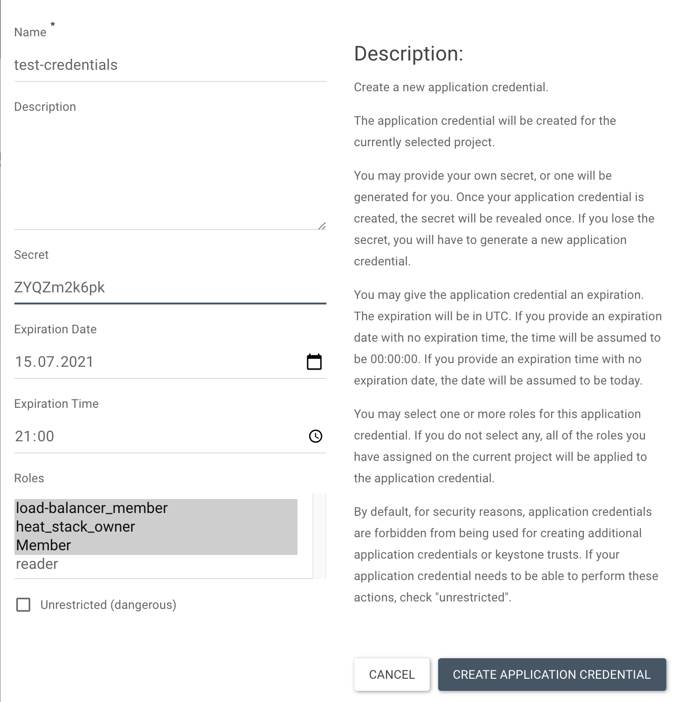
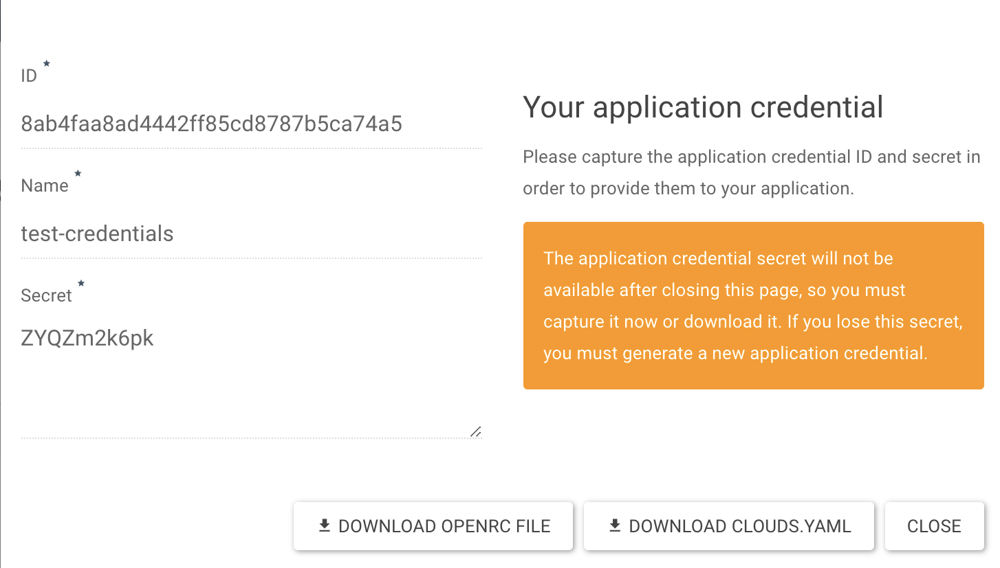
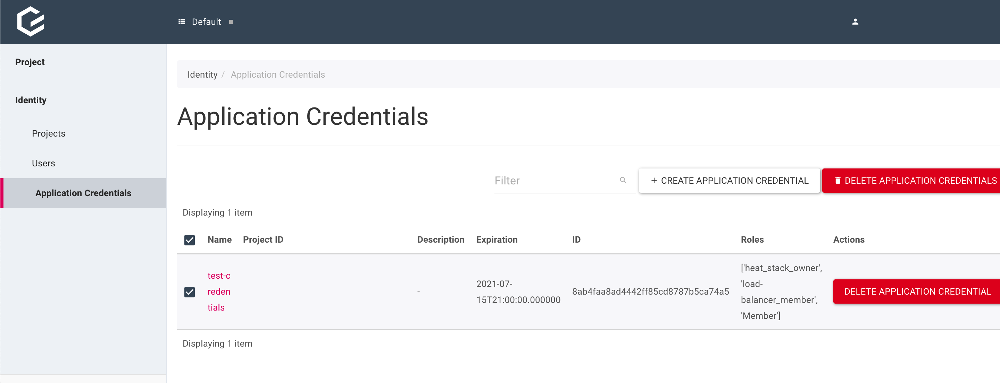

# Introduction

Users can create Application Credentials to allow their applications to authenticate to the OpenStack Authentication component (Keystone) without needing to use the user's personal credentials.

With application credentials, applications can authenticate with the application credential ID and a secret string which is not the user’s password. This way, the user’s password is not embedded in the application’s configuration.

Users can delegate a subset of their role assignments on a project to application credentials, granting the application the same or restricted permissions within a project.

## Requirements for Application Credentials

### Name / Secrets

Application credentials can be generated for your project via the command-line or via the dashboard. These will be associated with the project in which they are created.

The only required parameter to create the credentials is a name, however a specific secret can be set by using the `—-secret` parameter. If the secret parameter is left blank, a secret will instead be auto-generated in the output.

It is important to make note of the secret in either case as the secret is hashed before it is stored and will not be retrievable after it has been set. If the secret is lost, a new application credential should be created.

### Roles

We also recommend setting the roles that the Application Credentials should have in the project, since by default, a newly created set of credentials will inherit all available roles.

Below are the available roles which can be assigned to a set of application credentials. When applying these roles to a set of credentials using the `--role` parameter, please be aware that all role names are case-sensitive:

- `Member`: The "member" role only has administrative access to the assigned project.
- `heat_stack_owner`: As "heat_stack_owner" you are able to use and execute existing HEAT templates.
- `load-balancer_member`: As a “load-balancer_member" you can use the Octavia LoadBalancer resources.

### Expiration

By default, created Application Credentials will not expire, however,  fixed expiration dates/times can be set for credentials upon creation, using the `--expires` parameter in the command (for example: `--expires '2021-07-15T21:00:00'`).

## Creating Application Credentials via the CLI

A set of Application Credentials can be created in the desired project via the CLI, the example below demonstrates how to create a set of credentials with the following parameters:

- Name: test-credentials
- Secret: ZYQZm2k6pk
- Roles: Member, heat_stack_owner, load-balancer_member
- Expiration Date/Time: 2021-07-12 at 21:00:00

The new credentials should appear as follows:

```bash
$ openstack application credential create test-credentials --secret ZYQZm2k6pk --role Member --role heat_stack_owner --role load-balancer_member --expires '2021-07-15T21:00:00'
+--------------+----------------------------------------------+
| Field        | Value                                        |
+--------------+----------------------------------------------+
| description  | None                                         |
| expires_at   | 2021-07-15T21:00:00.000000                   |
| id           | 707d14e835124b4f957938bb5a57d1be             |
| name         | test-credentials                             |
| project_id   | c704ac5a32b84b54a0407d28ad448399             |
| roles        | Member heat_stack_owner load-balancer_member |
| secret       | ZYQZm2k6pk                                   |
| system       | None                                         |
| unrestricted | False                                        |
| user_id      | 1d9f1ecb5de3607e8982695f72036fa5             |
+--------------+----------------------------------------------+
```

Note: The secret (whether set by the user or auto-generated) will be displayed upon creation of the credentials. Please take note of the secret at this time.

## Viewing Application Credentials via the CLI

The list of application credentials belonging to a project can be listed with the following command.

```bash
$ openstack application credential list
+----------------------------------+-------------------+----------------------------------+-------------+------------+
| ID                               | Name              | Project ID                       | Description | Expires At |
+----------------------------------+-------------------+----------------------------------+-------------+------------+
| 707d14e835124b4f957938bb5a57d1be | test-credentials  | c704ac5a32b84b54a0407d28ad448399 | None        | None       |
+----------------------------------+-------------------+----------------------------------+-------------+------------+
```

Individual credentials can be viewed using the `$ openstack application credential show <name>` command.

## Deleting Application Credentials via the CLI

Application credentials can be deleted via the CLI with the following command with the name or ID of the specific set of credentials:

```bash
openstack application credential delete test-credentials
```

## Creating and Deleting Application Credentials via the Optimist Dashboard

Alternatively, Application credentials can also be generated via the Optimist Dashboard under Identity > Application credentials:



Note: Multiple roles can be selected here by holding shift and navigating through the options.

Once created, a dialog box will appear to instruct you to capture the ID and secret. Once done, click "Close".



The credentials here can also deleted at any point by using the checkbox to highlight the set of credentials to be deleted and then clicking "DELETE APPLICATION CREDENTIAL"



## Testing Application credentials

Once we have created a set of Application Credentials either via the CLI or dashboard, we can test them by using the following curl command to verify that they are working.

We need to use our `<name>` and `<secret>` in the curl command:

```bash
curl -i -H "Content-Type: application/json" -d ' { "auth": { "identity": { "methods": ["application_credential"],  "application_credential": {  "id": “<id>", "secret": “<secret>"}}}}' https://identity.optimist.innovo.cloud/v3/auth/tokens
```

A successful curl attempt will output an `x-subject-token`, unsuccessful attempts where the credentials are incorrect will result in a 401 error.
