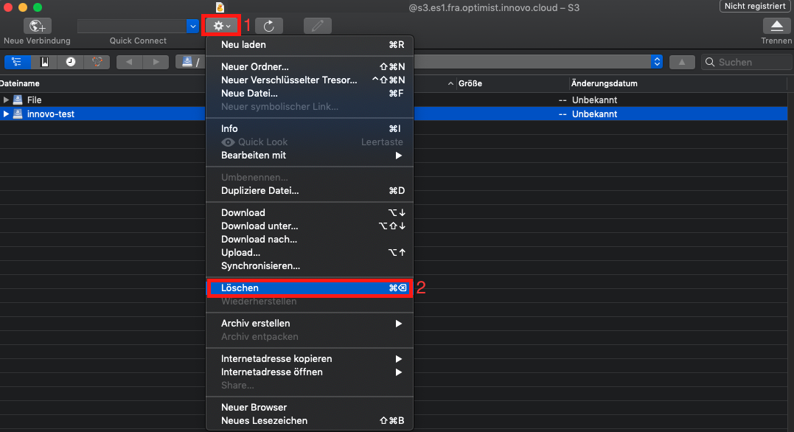

Einen Bucket erstellen und wieder löschen
=================================================

Inhalt:
---------
- [S3cmd](#S3cmd)
	- [Bucket erstellen](#bucket-erstellen)
	- [Bucket löschen](#bucket-löschen)
- [S3Browser](#s3browser)
	- [Bucket erstellen](#bucket-erstellen-1)
	- [Bucket löschen](#bucket-löschen-1)
- [Cyberduck](#cyberduck)
	- [Bucket erstellen](#bucket-erstellen-2)
	- [Bucket löschen](#bucket-löschen-2)
- [Boto3](#boto3)
	- [Bucket erstellen](#bucket-erstellen-3)
	- [Bucket löschen](#bucket-löschen-3)

Zum Hochladen Ihrer Daten wie zum Beispiel (Dokumente, Fotos, Videos, usw.) ist es zunächst notwendig einen Bucket zu erstellen. Dieser dient als eine Art Ordner.

Aufgrund der Funktionsweise unseres Objects-Storages ist es notwendig einen global eindeutigen Namen für Ihren Bucket zu verwenden.

Sollte bereits ein Bucket mit dem gewählten Namen existieren, kann der Name erst verwendet werden, wenn der bereits existierende Bucket gelöscht wurde.

Sollte der gewünschte Name bereits von einem weiteren Kunden in Benutzung sein müssen sie einen anderen Namen wählen.

Es empfiehlt sich, Namen der Form inhaltsbeschreibung.bucket.meine-domain.tld  oder vergleichbares zu verwenden.

[S3cmd](#S3cmd)
=============

# Bucket erstellen

Um einen Bucket zu erstellen, nutzt man folgenden Befehl:

```bash
$ s3cmd mb s3://NameDesBuckets
```

Die Ausgabe in der Kommandozeile kann dann so aussehen:

```bash
$ s3cmd mb s3://iNNOVO-Test
Bucket 's3://iNNOVO-Test/' created
```

# Bucket löschen

Um einen Bucket zu löschen, nutzt man folgenden Befehl:

```bash
$ s3cmd rb s3://NameDesBuckets
```

Die Ausgabe in der Kommandozeile kann dann so aussehen:

```bash
$ s3cmd rb s3://iNNOVO-Test
Bucket 's3://iNNOVO-Test/' removed
```

[S3Browser](#s3browser)
=============

# Bucket erstellen

Nach dem Öffnen von S3Browser, klicken wir oben links auf "New bucket"(1), in dem sich öffnenden Fenster vergeben wir unter "Bucket name"(2) den Namen des Buckets und klicken dann auf "Create new bucket"(3).


# Bucket löschen

Zuerst wird der zu löschende Bucket markiert(1) und danch oben links auf "Delete bucket" geklickt.


Im sich nun öffnenden Fenster, bestätigen mit dem markieren der Checkbox(1), dass die Datei gelöscht werden soll und klicken dann auf "Delete Bucket"(2).


[Cyberduck](#cyberduck)
=============

# Bucket erstellen

Nach dem Öffnen von Cyberduck, klicken wir oben in der Mitte auf "Aktion"(1) und auf "Neuer Ordner"(2)


Danach öffnet sich das folgende Fenster, hier können wir den Namen(1) festlegen und bestätigen dies im Anschluß mit "Anlegen"(2):


# Bucket löschen

Um einen Bucket zu löschen, wird dieser mit einem linken Mausklick makiert. Gelöscht wird der Bucket dann über "Aktion"(1) und "Löschen"(2).



Die Bestätigung erfolgt dann über das erneute klicken auf "Löschen"(1)


[Boto3](#boto3)
=============

Bei boto3 brauchen wir zunächst die S3 Kennung, damit ein Script nutzbar ist. Für Details: [S3 Kennung erstellen und einlesen #boto3](https://docs.gec.io/de/optimist/storage/s3_documentation/createanduses3credentials)

# Bucket erstellen

Um nun einen Bucket zu erstellen, müssen wir einen Clienten nutzen und den Bucket dann erstellen.
Eine Option sieht so aus:

```bash
## Erstellung eines S3 Clienten
s3 = boto3.client('s3')

## Erstellung des Buckets
s3.create_bucket(Bucket='iNNOVO-Test')
```

Ein komplettes Script für boto 3 inkl. Authentifizierung kann so aussehen:

```python
#!/usr/bin/env/python

## Definieren das boto3 genutzt werden soll
import boto3
from botocore.client import Config

## Authentifizierung
s3 = boto3.resource('s3',
                        endpoint_url='https://s3.es1.fra.optimist.innovo.cloud',
                        aws_access_key_id='aaaaaaaaaaaaaaaaaaaaaaaaaaaaaaa',
                        aws_secret_access_key='bbbbbbbbbbbbbbbbbbbbbbbbbbbbbbbb',
                    )

## Erstellung eines S3 Clienten
s3 = boto3.client('s3')

## Erstellung des Buckets
s3.create_bucket(Bucket='iNNOVO-Test')
```

# Bucket löschen

Wie bei der Erstellung des Buckets, wird zunächst ein Client benötigt um dann den Bucket zu löschen.
Um nun einen Bucket zu erstellen, müssen wir einen Clienten nutzen und den Bucket dann erstellen.
Eine Option sieht so aus:

```bash
## Erstellung eines S3 Clienten
s3 = boto3.client('s3')

## Löschen eines Buckets
s3.delete_bucket(Bucket='iNNOVO-Test')
```

Ein komplettes Script für boto 3 inkl. Authentifizierung kann so aussehen:

```python
#!/usr/bin/env/python

## Definieren das boto3 genutzt werden soll
import boto3
from botocore.client import Config

## Authentifizierung
s3 = boto3.resource('s3',
                        endpoint_url='https://s3.es1.fra.optimist.innovo.cloud',
                        aws_access_key_id='aaaaaaaaaaaaaaaaaaaaaaaaaaaaaaa',
                        aws_secret_access_key='6229490344a445f2aa59cdc0e53add88',
                    )

## Erstellung eines S3 Clienten
s3 = boto3.client('s3')

## Erstellung des Buckets
s3.delete_bucket(Bucket='iNNOVO-Test')
```
