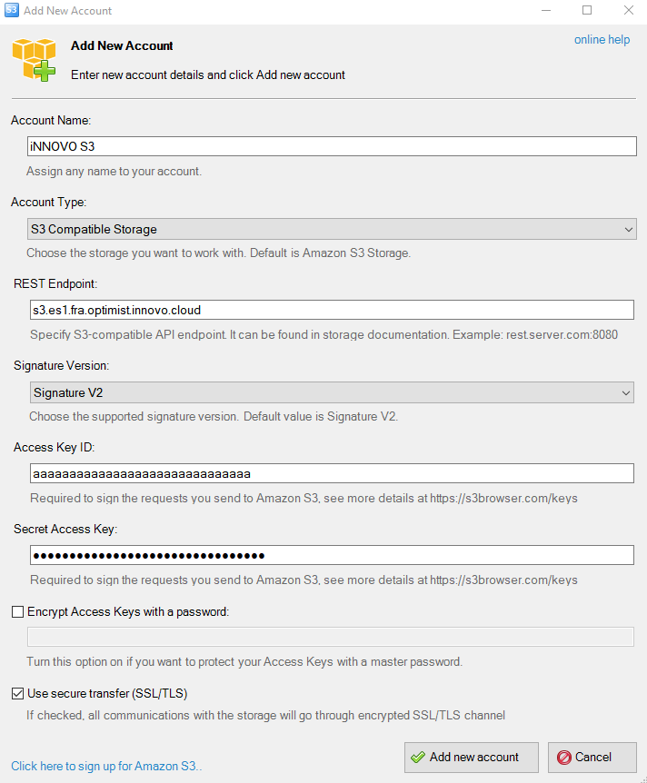

Create and Use S3 Credentials
=================================================

Contents:
-----------
- [Create S3 credentials](#creates3credentials)
	- [S3cmd](#s3cmd)
	- [S3Browser](#s3browser)
	- [Cyberduck](#cyberduck)
	- [Boto3](#boto3)

[Create S3 credentials](#creates3credentials)
=============

In order to access Object Storage, we first need login data (credentials).
To generate this data via the OpenStackAPI, we need to use the OpenStack Client and execute the following command there:

`$ openstack ec2 credentials create`

If the data has been created correctly, the output will be similar to the below:

```bash
$ openstack ec2 credentials create
+------------+-----------------------------------------------------------------+
| Field      | Value                                                           |
+------------+-----------------------------------------------------------------+
| access     | aaaaaaaaaaaaaaaaaaaaaaaaaaaaaaa                                 |
| links      | {u'self': u'https://identity.optimist.innovo.cloud/v3/users/bbb |
|            | bbbbbbbbbbbbbbbbbbbbbbbbbbbbb/credentials/OS-                   |
|            | EC2/aaaaaaaaaaaaaaaaaaaaaaaaaaaaaaa'}                           |
| project_id | cccccccccccccccccccccccccccccccc                                |
| secret     | dddddddddddddddddddddddddddddddd                                |
| trust_id   | None                                                            |
| user_id    | bbbbbbbbbbbbbbbbbbbbbbbbbbbbbbbb                                |
+------------+-----------------------------------------------------------------+
```

Once the credentials are available, we need a way to access the S3 compatible ObjectStorage.
For this, there are different options, in this documentation we present 3 possibilities: [S3cmd](https://s3tools.org/s3cmd) for Linux/Mac, [S3Browser](https://s3browser.com/) for Windows, [Cyberduck](https://cyberduck.io/) and [Boto3](https://boto3.amazonaws.com/v1/documentation/api/latest/index.html).


Entering User Data in the Configuration File
=============

[S3cmd](#s3cmd)
-----------------------

To install s3cmd, we need a package manager such as "pip". The installation and usage is explained in [Step 4: "Our way to the console"](https://docs.gec.io/optimist/guided_tour/step04) of our Guided Tour.
Once pip is installed, the command for the installation of S3cmd is then: 

`$ pip install s3cmd`

After the successful installation of S3cmd, the previously created credentials must be entered into S3cmd configuration file.
The file responsible for this is ".s3cfg", which is located in the home directory by default. If this file does not yet exist, it must first be created.

We then enter the following data in the .s3cfg and save it:

```bash
access_key = aaaaaaaaaaaaaaaaaaaaaaaaaaaaaaaaaaaaaaa
check_ssl_certificate = True
check_ssl_hostname = True
host_base = s3.es1.fra.optimist.innovo.cloud
host_bucket = s3.es1.fra.optimist.innovo.cloud
secret_key = dddddddddddddddddddddddddddddddd
use_https = True
```

[S3Browser](#s3browser)
-----------------------
The S3Browser can be downloaded [here](https://s3browser.com/) and easily installed afterwards.
After this has been successfully installed, we then need to enter all necessary credentials.
To do this, we open the S3Browser and the following window opens automatically the first time we run the application:



Here we enter the following values and click on "Add new account".
```
* Account Name: Freely selectable name for the account.
* Account Type: S3 Compatible Storage
* REST Endpoint: s3.es1.fra.optimist.innovo.cloud
* Signature Version: Signature V2
* Access Key ID: The corresponding Access Key (in our example: ddddddddddddddddddddddddddddddddddddd)
* Secret Access Key: The corresponding secret (in our example: ddddddddddddddddddddddddddddddddddddd)
```

[Cyberduck](#cyberduck)
-----------------------

To use Cyberduck it is first necessary to download the application [here](https://cyberduck.io/). 
After installing and running the program for the first time, click on "New connection". (1)
A new window opens in which "Amazon S3" is selected in the dropdown menu (2). The following data is then required:

	- Server(3): s3.es1.fra.optimist.innovo.cloud
	- Access Key ID(4): The corresponding Access Key (in our example: ddddddddddddddddddddddddddddddddddddd)
	- Secret Access Key(5): The corresponding Secret (In the example: dddddddddddddddddddddddddddddddddd)


Finally, to establish a connection, click on "Connect".

[Boto3](#boto3)
-----------------------

To install boto3, we need a package manager such as "pip". The installation and usage of pip is explained in [Step 4: "Our way to the console"](https://docs.innovo.cloud/guided_tour/en/step04/) of our Guided Tour.
Once pip is installed, the command for the installation of Boto3 is then: 

`$ pip install boto3`

After the successful installation of Boto3 it is now usable; it is important that Boto3 creates a script which is executed at the end. 
Therefore, the configuration section which is shown below, is always part of subsequent scripts used later. 
For this we create a Python file such as "Example.py" and add the following content:

	- endpoint_url: s3.es1.fra.optimist.innovo.cloud
	- aws_access_key_id: The corresponding Access Key (in our example: dddddddddddddddddddddddddddddddddddd)
	- aws_secret_access_key: The corresponding Secret (In the example: dddddddddddddddddddddddddddddddddd)

```python
#!/usr/bin/env/python
 
import boto3
from botocore.client import Config
 
s3 = boto3.resource('s3',
                        endpoint_url='https://s3.es1.fra.optimist.innovo.cloud',
                        aws_access_key_id='aaaaaaaaaaaaaaaaaaaaaaaaaaaaaaaaaaaaaaa',
                        aws_secret_access_key='dddddddddddddddddddddddddddddddd',
                    )
```

This serves as a starting point and is referenced and used in the following scripts.
