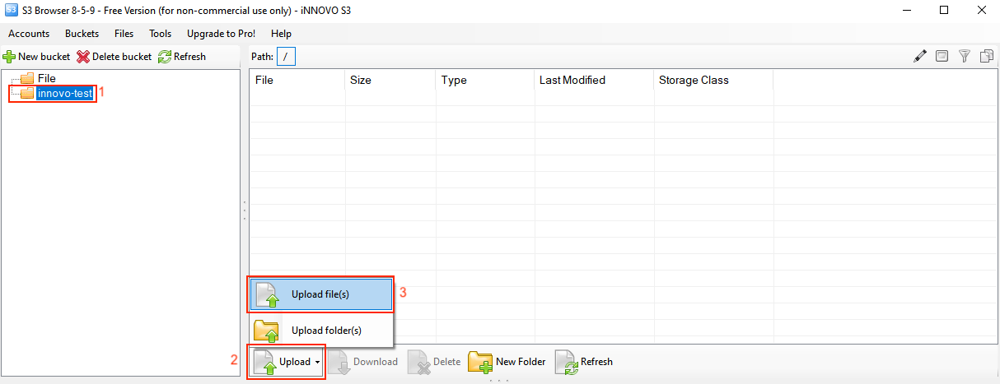
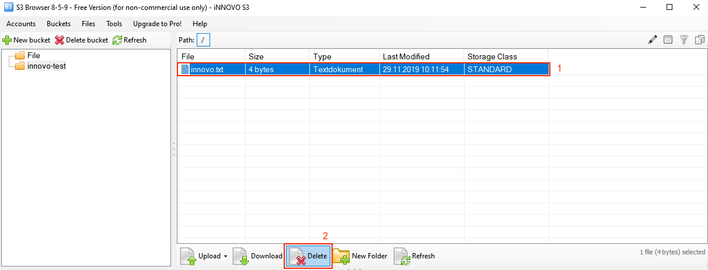

Upload and delete an object
=================================================

Contents:
-----------
- [S3cmd](#s3cmd)
- [S3Browser](#s3browser)
- [Cyberduck](#cyberduck)
- [Boto3](#boto3)

To upload your data (documents, photos, videos, etc.) it is first necessary to [create a bucket](/optimist/storage/s3_documentation/createanddeletebucket/).
A file can only be saved in a bucket.

# S3cmd

## Upload an object

To upload a file, use the following command:

```bash
$ s3cmd put NameOfTheFile s3://NameOfTheBucket/NameOfTheFile
```

The output in the command will be similar to this:

```bash
$ s3cmd put innovo.txt s3://innovo-test/innovo.txt
upload: 'innovo.txt' -> 's3://innovo-test/innovo.txt'  [1 of 1]
 95 of 95   100% in    0s   176.63 B/s  done
```

## Delete an object

To delete a file, use the following command:

```bash
$ s3cmd del s3://NameOfTheBucket/NameOfTheFile
```

The output in the command will be similar to this:

```bash
$ s3cmd del s3://innovo-test/innovo.txt
delete: 's3://innovo-test/innovo.txt'
```

# S3Browser

## Upload an object

After opening S3Browser, we click on the desired "Bucket"(1), then select "Upload"(2) and finally "Upload file(s)"(3)



Here we select the file(1) and click on Open(2).


## Delete an object

To delete a file, select it with a left mouse click(1). Then click on "Delete"(2).



Finally, confirm the action with "Yes". 


# Cyberduck

## Upload an object

After opening Cyberduck, click on the Bucket(1), then click on Action(2) and then on Upload(3).


Here we choose our file and click on Upload.

## Delete an object

To delete a file, select it with a left mouse click(1). It is then deleted via "Action"(2) and "Delete"(3). 


This action is then confirmed by clicking on "Delete" again.


# Boto3

At boto3 we first need the S3 identifier so that a script can be used. For details: [Create and use S3 credentials #Boto3](/optimist/storage/s3_documentation/createanduses3credentials#boto3).

## Upload an object

To upload a file, we have to use a client and specify the bucket which the file should be uploaded to.
One option could look like this:

```bash
## Create the S3 client
s3 = boto3.client('s3')
 
## Upload an object
s3.upload_file(Bucket='iNNOVO-Test', Key='innovo.txt')
```

A complete script for boto 3 including authentication may be similar to this:

```python
#!/usr/bin/env/python
 
## Define that boto3 should be used
import boto3
from botocore.client import Config
 
## Authentication
s3 = boto3.resource('s3',
                        endpoint_url='https://s3.es1.fra.optimist.innovo.cloud',
                        aws_access_key_id='aaaaaaaaaaaaaaaaaaaaaaaaaaaaaaaa',
                        aws_secret_access_key='bbbbbbbbbbbbbbbbbbbbbbbbbbbbbbbbbb',
                    )
 
## Create the S3 client
s3 = boto3.client('s3')
 
## Upload an object
s3.upload_file(Bucket='iNNOVO-Test', Key='innovo.txt')
```

## Delete an object

As well as being used to upload a file, the client is also required to delete the file.
For this, we specify the bucket in which the file is stored, in addition to the file itself. 
One option could look like this:

```bash
## Create the S3 client
s3 = boto3.client('s3')

## Delete an object
s3.delete_object(Bucket='iNNOVO-Test', Key='innovo.txt')
```

A complete script for boto 3 including authentication may look like this:

```python
#!/usr/bin/env/python
 
## Define that boto3 should be used
import boto3
from botocore.client import Config
 
## Authentication
s3 = boto3.resource('s3',
                        endpoint_url='https://s3.es1.fra.optimist.innovo.cloud',
                        aws_access_key_id='aaaaaaaaaaaaaaaaaaaaaaaaaaaaaaaa',
                        aws_secret_access_key='bbbbbbbbbbbbbbbbbbbbbbbbbbbbbbbbbb',
                    )
 
## Create the S3 client
s3 = boto3.client('s3')
 
## Delete an object
s3.delete_object(Bucket='iNNOVO-Test', Key='innovo.txt')
```
