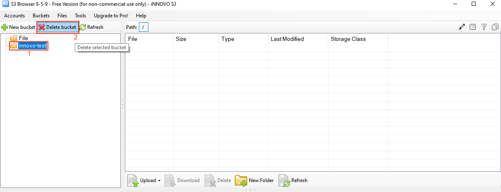

# Einen Bucket erstellen und wieder löschen

## Inhalt:

- [S3cmd](#S3cmd)
- [S3Browser](#s3browser)
- [Cyberduck](#cyberduck)
- [Boto3](#boto3)

Zum Hochladen Ihrer Daten (z.B. Dokumente, Fotos, Videos, usw.) muss zunächst ein Bucket erstellt werden. Dieser dient als eine Art Ordner.

Aufgrund der Funktionsweise unseres Objects-Storages muss ein global eindeutiger Namen für den Bucket verwendet werden.

Sollte bereits ein Bucket mit dem gewählten Namen existieren, kann der Name erst verwendet werden, wenn der bereits existierende Bucket gelöscht wurde.

Wird der gewünschte Name bereits von einem anderen Kunden benutzt, muss ein anderer Name vergeben werden.

Es empfiehlt sich, Namen der Form `inhaltsbeschreibung.bucket.meine-domain.tld` oder Vergleichbares zu verwenden.

## S3cmd

### Erstellen des Buckets

Nutzen Sie den folgenden Befehl, um den Bucket zu erstellen:

```bash
s3cmd mb s3://NameDesBuckets
```

Die Ausgabe in der Kommandozeile kann dann so aussehen:

```bash
$ s3cmd mb s3://iNNOVO-Test
Bucket 's3://iNNOVO-Test/' created
```

### Löschen des Buckets

Nutzen Sie den folgenden Befehl, um den Bucket zu löschen:

```bash
s3cmd rb s3://NameDesBuckets
```

Die Ausgabe in der Kommandozeile kann dann so aussehen:

```bash
$ s3cmd rb s3://iNNOVO-Test
Bucket 's3://iNNOVO-Test/' removed
```

## S3Browser

### Erstellen des Buckets

Nach dem Öffnen von S3 Browser, klicken Sie oben links auf *New bucket* (1). Vergeben Sie in dem sich öffnenden Fenster unter *Bucket name*(2) den Namen des Buckets und klicken auf *Create new bucket* (3).


### Löschen des Buckets

Markieren Sie den zu löschenden Bucket (1) und klicken Sie danach oben links auf *Delete bucket*.



Markieren Sie im sich öffnenden Fenster die Checkbox (1) zum Bestätigen des Löschens. Klicken Sie anschließend auf *Delete Bucket* (2).


## Cyberduck

### Erstellen des Buckets

Nach dem Öffnen von Cyberduck, klicken Sie oben in der Mitte auf *Aktion* (1) und auf *Neuer Ordner* (2):


 Legen Sie in dem sich öffnenden Fenster den Namen (1) fest und bestätigen Sie ihn mit *Anlegen* (2):


### Löschen des Buckets

Um einen Bucket zu löschen, markieren Sie diesen mit einem linken Mausklick. Löschen Sie dann den Bucket mit *Aktion* (1) und *Löschen* (2).


Bestätigen Sie die Löschung, indem Sie erneut auf *Löschen* (1) klicken.


## Boto3

Bei boto3 brauchen Sie zunächst die S3 Kennung, damit ein Script nutzbar ist. Details finden Sie unter: [S3 Kennung erstellen und einlesen #boto3](/optimist/storage/s3_documentation/createanduses3credentials/#boto3).

### Erstellen des Buckets

Um einen Bucket zu erstellen, müssen Sie einen Client nutzen und dann den Bucket erstellen.
Eine Option sieht so aus:

```bash
## Erstellung eines S3 Client
s3 = boto3.client('s3')

## Erstellung des Buckets
s3.create_bucket(Bucket='iNNOVO-Test')
```

Ein komplettes Script für boto 3 einschließlich Authentifizierung kann so aussehen:

```python
#!/usr/bin/env/python

## Definieren das boto3 genutzt werden soll
import boto3
from botocore.client import Config

## Authentifizierung
s3 = boto3.resource('s3',
                        endpoint_url='https://s3.es1.fra.optimist.innovo.cloud',
                        aws_access_key_id='aaaaaaaaaaaaaaaaaaaaaaaaaaaaaaa',
                        aws_secret_access_key='bbbbbbbbbbbbbbbbbbbbbbbbbbbbbbbb',
                    )

## Erstellen eines S3 Clienten
s3 = boto3.client('s3')

## Erstellen des Buckets
s3.create_bucket(Bucket='iNNOVO-Test')
```

### Löschen des Buckets

Um einen Bucket zu löschen, wird wie bei der Erstellung zuerst ein Client benötigt und dann der Bucket gelöscht.
Eine Option sieht so aus:

```bash
## Erstellen eines S3 Clienten
s3 = boto3.client('s3')

## Löschen eines Buckets
s3.delete_bucket(Bucket='iNNOVO-Test')
```

Ein komplettes Script für boto 3 inkl. Authentifizierung kann so aussehen:

```python
#!/usr/bin/env/python

## Definieren das boto3 genutzt werden soll
import boto3
from botocore.client import Config

## Authentifizierung
s3 = boto3.resource('s3',
                        endpoint_url='https://s3.es1.fra.optimist.innovo.cloud',
                        aws_access_key_id='aaaaaaaaaaaaaaaaaaaaaaaaaaaaaaa',
                        aws_secret_access_key='6229490344a445f2aa59cdc0e53add88',
                    )

## Erstellen eines S3 Clienten
s3 = boto3.client('s3')

## Erstellen des Buckets
s3.delete_bucket(Bucket='iNNOVO-Test')
```
