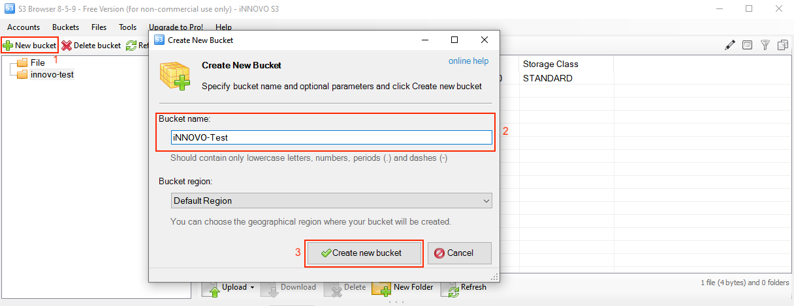
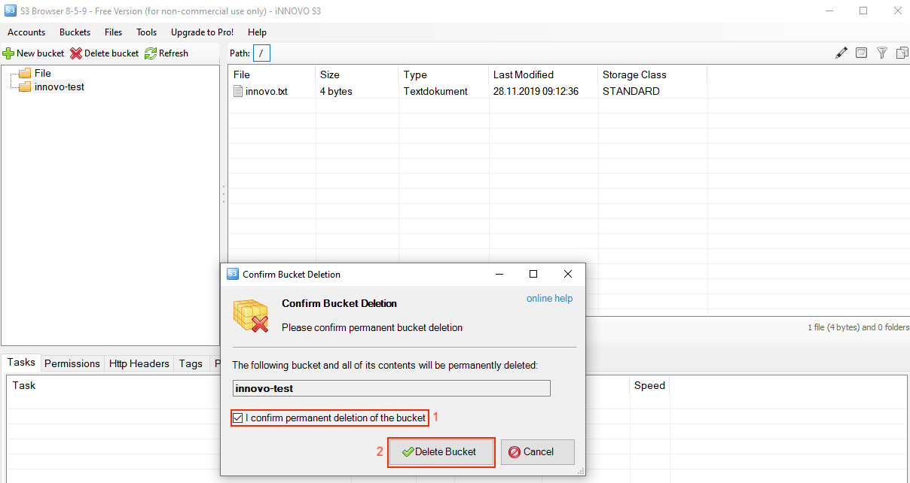

# Create and Delete a Bucket

**Contents:**

- [S3cmd](#s3cmd)
- [S3Browser](#s3browser)
- [Cyberduck](#cyberduck)
- [Boto3](#boto3)

To upload your data (documents, photos, videos, and so on) you need to create a bucket, which is similar to a folder. First create an S3 bucket and then you can upload as many objects as required into the bucket.

Due to the way our object storage works, it is necessary to use a globally unique name for your bucket.

If a bucket with the selected name already exists, the name cannot be used until the existing bucket has been deleted.

If the desired name is already in use by another customer, you must choose another name.

It is advisable to use names of the format "content-description.bucket.my-domain.tld" or similar.

## S3cmd

### Create a bucket

To create a bucket, use the following command:

```bash
s3cmd mb s3://NameOfTheBucket
```

The output in the command line will look similar to this:

```bash
$ s3cmd mb s3://iNNOVO-Test
Bucket 's3://iNNOVO-Test/' created
```

### Delete a bucket

To delete a bucket, use the following command:

```bash
s3cmd rb s3://NameOfTheBucket
```

The output in the command line will look similar to this:

```bash
$ s3cmd rb s3://iNNOVO-Test
Bucket 's3://iNNOVO-Test/' removed
```

## S3Browser

### Create a bucket

After opening S3 Browser, click on *New bucket* (1) in the upper left corner. In the newly opened window, assign the name of the bucket with *Bucket name* (2) and then click on *Create new bucket* (3).



### Delete a bucket

First select the bucket you want to delete (1) and then click on *Delete bucket* (2) in the upper left corner.


In the window that opens, confirm that you want to delete the file by checking the checkbox (1) and then click on *Delete Bucket* (2).



## Cyberduck

### Create a bucket

After opening Cyberduck, click on *Action* (1) and on *New folder* (2) in the middle of the top.


A new window opens. Here you can define the name (1) and confirm this with *Create* (2):


### Delete a bucket

To delete a bucket, select it with a left mouse click. Then delete the bucket with *Action* (1) and *Delete* (2).


Confirm the action by clicking on *Delete* (1) once again.


## Boto3

In Boto3 you first need the S3 identifier so that a script can be used. For details see: [Create and use S3 credentials #Boto3](/optimist/storage/s3_documentation/createanduses3credentials/#boto3)

### Create a bucket

To create a bucket, you first need a client for it and you will then create the bucket afterwards.
One option looks like this:

```bash
## Create the S3 client
s3 = boto3.client('s3')

## Create a bucket
s3.create_bucket(Bucket='iNNOVO-Test')
```

A complete script for boto 3 including authentication may look like this:

```python
#!/usr/bin/env/python

## Define that boto3 should be used
import boto3
from botocore.client import Config

## Authentication
s3 = boto3.resource('s3',
                        endpoint_url='https://s3.es1.fra.optimist.innovo.cloud',
                        aws_access_key_id='aaaaaaaaaaaaaaaaaaaaaaaaaaaaaaaa',
                        aws_secret_access_key='bbbbbbbbbbbbbbbbbbbbbbbbbbbbbbbbbb',
                    )

## Create the S3 client
s3 = boto3.client('s3')

## Create a bucket
s3.create_bucket(Bucket='iNNOVO-Test')
```

### Delete a bucket

As before, you first need a client to delete the bucket.
One option looks like this:

```python
## Create the S3 client
s3 = boto3.client('s3')

## Delete a bucket
s3.delete_bucket(Bucket='iNNOVO-Test')
```

A complete script for boto 3 including authentication may look like this:

```python
#!/usr/bin/env/python

## Define that boto3 should be used
import boto3
from botocore.client import Config

## Authentication
s3 = boto3.resource('s3',
                        endpoint_url='https://s3.es1.fra.optimist.innovo.cloud',
                        aws_access_key_id='aaaaaaaaaaaaaaaaaaaaaaaaaaaaaaaa',
                        aws_secret_access_key='bbbbbbbbbbbbbbbbbbbbbbbbbbbbbbbbbb',
                    )

## Create the S3 client
s3 = boto3.client('s3')

## Delete a bucket
s3.delete_bucket(Bucket='iNNOVO-Test')
```
