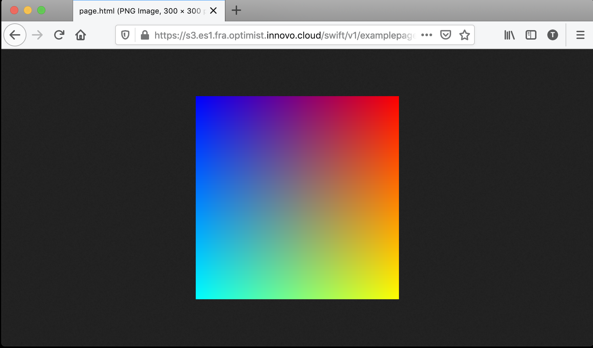

# Swift - Serving Static Websites

## Introduction

Using the Swift command line, it is possible to serve the data in containers as a static website. The following guide outlines the main steps to get started, as well as including an example of a website.

## First steps

### Create a container

You will first create a container named `example-webpage` which you will use as the basis of this guide:

```bash
swift post example-webpage
```

### Make the container publically readable

Next, you must ensure that the container is publically readable. You can learn more about securing containers and setting bucket policies [here](/optimist/storage/s3_documentation/security/):

```bash
swift post -r '.r:*' example-webpage
```

### Set site index file

Set the index file. In this case, index.html will be the default file displayed when the site appears:

```bash
swift post -m 'web-index:index.html' example-webpage
```

### Enable file listing

Optionally, you can also enable file listing. If you need to provide multiple downloads, enabling the directory listing makes sense:

```bash
swift post -m 'web-listings: true' example-webpage
```

### Enable CSS for file listing

Enable a custom listings style sheet:

```bash
swift post -m 'web-listings-css:style.css' example-webpage
```

### Set error pages

Finally, you should include a custom error page:

```bash
swift post -m 'web-error:404error.html' example-webpage
```

## Example web page

Let us recap the steps you have taken so far to enable static web pages:

```bash
swift post example-webpage
swift post -r '.r:*' example-webpage
swift post -m 'web-index:index.html' example-webpage
swift post -m 'web-listings: true' example-webpage
swift post -m 'web-listings-css:style.css' example-webpage
swift post -m 'web-error:404error.html' example-webpage
```

Once the steps above have been completed, you can now begin to customise your static web page. The following demonstrates a quick setup using your container `example-webpage`

### Customising index.html, page.html, and 404error.html pages

This serves as the homepage, which creates a link to a secondary page.

```html
<!-- index.html -->
<html>
<h1>
See the web page <a href="mywebsite/page.html">here</a>.
</h1>
</html>
```

The next page (page.html) displays an image called `sample.png`:

```html
<!-- page.html -->
<html>

</html>
```

You can also add custom error pages. Note that currently only 401 (Unauthorized) and 404 (Not Found) errors are supported. The following example demonstrates the creation of a 404 Error page:

```html
<!-- 404error.html -->
<html>
<h1>
404 Not Found - We cannot find the page you are looking for!
</h1>
</html>
```

### Upload the index.html and page.html files

Once the contents of the files have been added, upload the files with the following commands:

```bash
swift upload example-webpage index.html
swift upload example-webpage mywebsite/page.html
swift upload example-webpage mywebsite/sample.png
swift upload example-webpage 404error.html
```

### Viewing the website

Once all of the above steps have been completed, you can now view your newly created website. The link to the website is available on the *Optimist Dashboard → Object Store → Containers* using the link shown.

Clicking on the link displays your newly created website:


Click on "here" to navigate to the page where you uploaded your sample image:



In the event that you try to navigate to a page which does not exist, your custom 404 page will be displayed:


